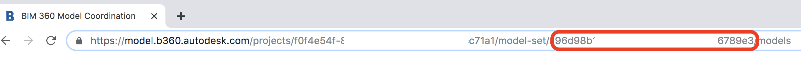

# BIM 360 Model Coordination API .NET Core Tutorial


 
 

[](https://code.visualstudio.com)

[](https://forge.autodesk.com/en/docs/oauth/v2/overview/)
[](https://forge.autodesk.com/en/docs/data/v2/developers_guide/overview/)
[](https://forge.autodesk.com/en/docs/viewer/v7/developers_guide/overview/)
[](https://forge.autodesk.com/en/docs/bim360/v1/overview/introduction/) 

[]( https://www.nuget.org/packages/Autodesk.Forge.Bim360.ModelCoordination.Modelset/)
[]( https://www.nuget.org/packages/Autodesk.Forge.Bim360.ModelCoordination.Clash/)
[]( https://www.nuget.org/packages/Autodesk.Forge.Bim360.ModelCoordination.Index/)

[](http://opensource.org/licenses/MIT)
[](http://developer.autodesk.com/)

## Description

This repository demonstrates basic scenarios of Model Coordination API in .NET Core, including modelsets, clash, property index and clash issue etc. It also provides a demo on how to classify the raw data, applying them in further comprehensive scenarios.
 
## Available Samples

| Order | Sample | Description | Demo |
| --- | --- | --- | --- |
|1|[Environment Check](src/TestEnvironmentSetup/Program.cs)|A sanity check of the current developer environment|[video](https://youtu.be/UV2sm0n3jzg)
|2|[Create Model Set](src/CreateModelSetSample/Program.cs)|Creating a model set from first principals|[video](https://youtu.be/XKqajnrqQFM)
|3|[Model Set Versions](src/GetModelSetAndVersionsSample/Program.cs)|Querying model set versions via version number and tip|[video](https://youtu.be/si6Jhkkk_Ro)
|4|[Clash Results](src/GetClashResultsSample/Program.cs)|Working with clash test result resources|[video](https://youtu.be/wD-QeKSjWhE)
|5|[Assigned and Closed Clash](src/AssignedAndClosedClashGroupSample/Program.cs)|Querying assigned/closed clash groups and issue details|[video](https://youtu.be/BZXiA391cxY)
|6|[Model Set Indexes](src/QueryModelSetVersionIndexSample/Program.cs)|BIM property querying against a model set version index|[video](https://youtu.be/gRIXS-mJXCc)
|7|[Model Set Views](src/CreateAndQueryViewsSample/Program.cs)|Create and query mode set custom views|[video](https://youtu.be/gRIXS-mJXCc)
|8|[Classify Clashing Objects](src/ClassifyClashingObjectsSample/Program.cs)|Use BIM property index to classify clashing objects|[video](https://youtu.be/4d2foJRU2aQ)

The samples in this repo build on one another. The execution order above matters. After [Create Model Set](src/CreateModelSetSample/Program.cs), please wait some time for coordinating process completes. Then run the other samples.
 
If you have not used the sample which creates a model set then you will not be able to use the remaining samples without first tweaking the model set input variables. To play with previous model sets, please note:

```diff
-     Note: The logic of this sample works for model set which are created after Oct 1st,2019
```
 

## Setup

### Prerequisites

1. **.NET Core**: The console applications currently target `netcoreapp3.0` and have a single `netstandard2.1` dependency. If you would like to try the [AuthWeb ASP.NET Core Blazor web application](src/AuthWeb) for configuring the samples and obtaining a Forge token the you will need to install the latest .NET Core 3.1 SDK (currently preview 2.0). .NET Core 3.1 is likely to be the next LTS release from Microsoft (see the following [blog post]( https://devblogs.microsoft.com/dotnet/announcing-net-core-3-1-preview-2/))

- This repo contains large RVT sample files and uses [`git lfs`](https://git-lfs.github.com/), make sure you clone accordingly :warning:
- [.NET Core 3.0 SDK](https://dotnet.microsoft.com/download/dotnet-core/3.0) for .NET Core Samples.

Optional :-

- [.NET Core 3.1 Preview 2 SDK]( https://dotnet.microsoft.com/download/dotnet-core/3.1) for AuthWeb support (ASP.NET Blazor) . Check **option #3** in [RuntimeConfig.md](RuntimeConfig.md)
- [PowerShell Core]( https://github.com/PowerShell/PowerShell) useful .NET command shell

2. **Forge Account**: Learn how to create a Forge Account, activate subscription and create an app at [this tutorial](http://learnforge.autodesk.io/#/account/). Get _Forge client id_, _Forge client secret_ and _Forge callback url_. These can be used by **option #3** (in [RuntimeConfig.md](RuntimeConfig.md)) to get 3-legged token. Please register Forge app with the _callback url_ as 

    ```https://localhost:5001/signin/oauth/callback```

3. **Postman**: This is optional, but recommendable to get 3-legged token. Check the tutorial of [Postman Scripts of Model Coordination API](https://github.com/xiaodongliang/bim360-mcapi-postman.test)for details.

4. **BIM 360 Account and project**: must be Account Admin to add the app integration. [Learn about provisioning](https://forge.autodesk.com/blog/bim-360-docs-provisioning-forge-apps). Make a not with the _account id_ and  _project id_.

5. Ensure [Model Coordination](https://knowledge.autodesk.com/support/bim-360/learn-explore/caas/CloudHelp/cloudhelp/ENU/BIM360D-Model-Coordination/files/GUID-38CC3A1C-92FF-4682-847F-9CFAFCC4CCCE-html.html) module has been activated in BIM 360 project.

6. Optional: If test with existing modelset, create some [modelsets of Model Coordination](https://knowledge.autodesk.com/support/bim-360/learn-explore/caas/CloudHelp/cloudhelp/ENU/BIM360D-Model-Coordination/files/GUID-38CC3A1C-92FF-4682-847F-9CFAFCC4CCCE-html.html) in BIM 360. Make a note with the _modelset id_. 

  <p align="center"></p>  

### Running locally

1. Clone this project or download it. It's recommended to install [GitHub desktop](https://desktop.github.com/). To clone it via command line, use the following (**Terminal** on MacOSX/Linux, **Git Shell** on Windows):

    git clone https://github.com/xiaodongliang/bim360-mcapi-node-pdf.exporter.sample

2. Open the project folder in **Visual Studio Code**.  The samples in this repo consist of a suite of .NET Core Console applications and a web application. To build and run these applications you will require the cross-platform .NET Core SDK. These samples also ship with a Microsoft Visual Studio solution; however **Visual Studio** is not a prerequisite for running this sample code.

3. In terminal, swtich to the folder of the specific sample, type **dotnet restore** to install the required packages and type ** dotnet build** to build the sample:

```powershell
 PS > cd ./src/{sample_folder}
 PS > dotnet restore
 PS > dotnet build
```
4. Each sample needs the following input configuration **Runtime Configuration**

| Sample | Description |
| --- | --- |
|AuthToken|A valid 8Forge OAuth 2.0 3-legged authentication token|
|AccountId|The BIM 360 Hub (Account) GUID to be used by the samples|
|ProjectId|The BIM 360 Project GUID to be used by the samples|some variables will 

Three options are available with this tutorial. Please check [RuntimeConfig.md](RuntimeConfig.md) for detail steps.

5. After the steps above, type **dotnet run** in the terminal to run the sample.
```powershell
 PS > cd ./src/{sample_folder}
 PS > dotnet run
```

Note: Please follow the sequence in **Available Samples** to test each sample. Check the appended video of each sample for demoing.

 
## Further Reading
- [Model Coordination API]( https://forge.autodesk.com/en/docs/bim360/v1/reference/http/mc-modelset-service-v3-create-model-set-POST/)
- [Model Coordination API SDK]( https://www.nuget.org/packages/Autodesk.Forge.Bim360.ModelCoordination.ModelSet/) 
- [BIM 360 API](https://forge.autodesk.com/en/docs/bim360/v1/overview/) and [App Provisioning](https://forge.autodesk.com/blog/bim-360-docs-provisioning-forge-apps)
- [Data Management API](https://forge.autodesk.com/en/docs/data/v2/overview/)

## Tutorials
- [Model Coordination API Document](https://forge.autodesk.com/en/docs/bim360/v1/tutorials/model-coordination)
- [Model Coordination API Node.js Tutorials]( https://github.com/xiaodongliang/bim360-mcapi-node-unit.test)

## License

This sample is licensed under the terms of the [MIT License](http://opensource.org/licenses/MIT). Please see the [LICENSE](LICENSE) file for full details.

## Written by
-	[Don Whittle](https://www.linkedin.com/in/don-whittle-4869088), Model Coordination engineering team, Autodesk.
-	reviewed by Xiaodong Liang [@coldwood](https://twitter.com/coldwood), [Forge Partner Development](http://forge.autodesk.com),Autodesk
