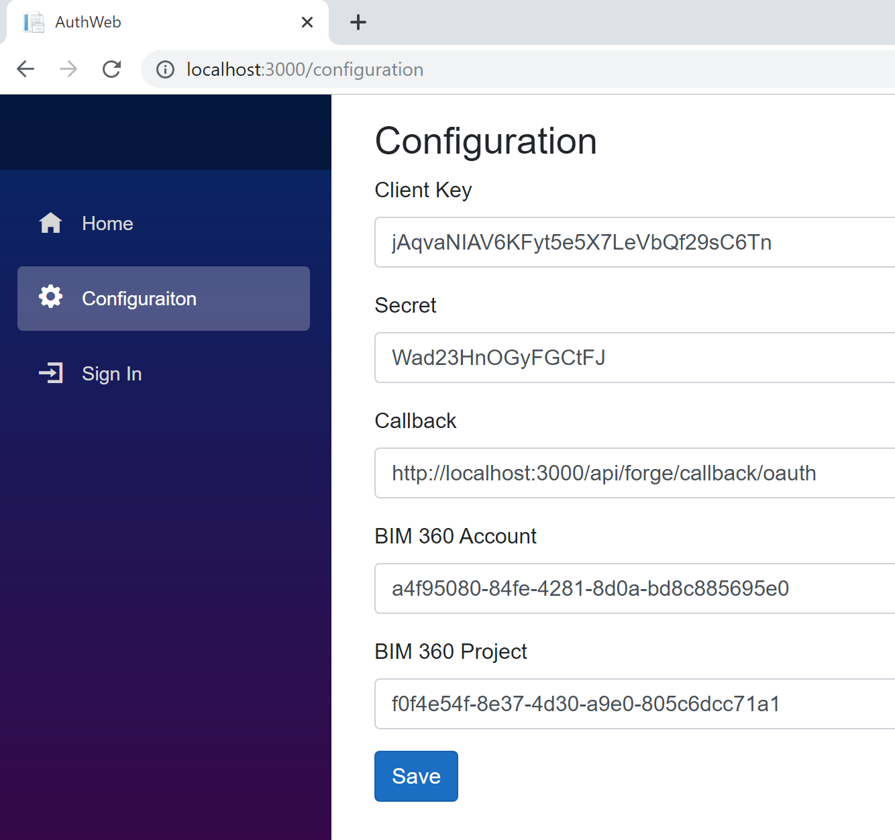
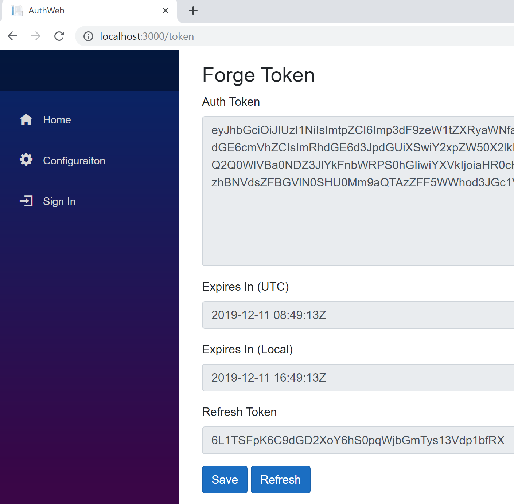

# Runtime Configuration Options

Each sample needs the following input configuration **Runtime Configuration**

| Sample | Description |
| --- | --- |
|AuthToken|A valid Forge OAuth 2.0 3-legged authentication token|
|AccountId|The BIM 360 Hub (Account) GUID to be used by the samples|
|ProjectId|The BIM 360 Project GUID to be used by the samples| 

There are three options for managing these values.

### Option 1: In-line

The simplest method is to pass these variables individually to each sample application. At the top of each `Program.cs` file you will see a call to `configuration.Load` commented out. If you uncomment this call, replacing the existing call to `configuration.Load()` you can manually pass these valuses for each sample.

```csharp
    configuration.Load(new Dictionary<string, string>
        {
            { "AuthToken", "Your Forge App OAuth token" },
            { "AccountId", "Your BIM 360 account GUID (no b. prefix)" },
            { "ProjectId", "Your BIM 360 project GUID (no b. prefix)"}
        });
```

### Option 2: SampleConfiguration.json (default)

The default mechanism to configure these sample is via a ` SampleConfiguration.json ` saved to a `.adsk-forge` the directory in the user's default profile directory. The following PowerShell command can be used to determine the location of this directory. For example, on a windows machine this is typically `c:\users\{user_name}` and `/Users/{user_name}` on OSX etc.

```powershell
 PS > [System.IO.Path]::Combine([System.Environment]::GetFolderPath('UserProfile'), '.adsk-forge')
``` 

To use the default `configuration.Load()` in the samples create a `.adsk-forge` folder and add a `SampleConfiguration.json` UTF-8 configuration file.

```json
{
  "AccountId": "Your BIM 360 account GUID (no b. prefix)",
  "ProjectId": "Your BIM 360 project GUID (no b. prefix)",
  "AuthToken": "Your Forge App OAuth token"
}
``` 

The [MCConfig](../samples/auxiliary/MCConfig) tool can be used to do this, either by running with **Visual Studio**, or from the command line. 

```powershell
 PS > cd ./src/MCConfig
 PS > dotnet restore
 PS > dotnet build
 PS > dotnet run --accountId={BIM 360 account GUID} --projectId={BIM 360 Project GUID} --authToken={auth token}
```

This application will create the `.adsk-forge` folder if it does not exist and write the `SampleConfiguration.json` file.

  <p align="center"></p>   

### Option 3: Using AuthWeb 

The [AuthWeb ASP.NET Core Blazor WebApp](/samples/auxiliary/AuthWeb) provides a GUI for writing the `SampleConfiguration.json` file and can also be used to request a Forge 3LO OAuth 2.0 authentication token. To use this application you will need to supply your Forge ClientId and Secret. AuthWeb writes these values to `SampleConfiguration.json` and can be used to set the value of AuthToken in this file. To run this application you need to set the callback URL of your Forge application to `http://localhost:3000/api/forge/callback/oauth`. Once you have updated your application configuration in Forge start the ASP.NET Core web server and browse to `http://localhost:3000`.

The tool can be run by **Visual Studio**, or from the command line:

    ```powershell
    PS > cd ./src/AuthWeb
    PS > dotnet restore
    PS > dotnet build
    PS > dotnet run
    ```   

In **Confiugration** tab, input hub id, project id , Forge app client id , client secret and callback url. Finally click save. It will produce or update `SampleConfiguration.json`.
  <p align="center"></p>   
Click **Sign In** tab, it will redirect to login user account of Autodesk. After it succeeds, the token will be generated.  Finally click save. It will update `SampleConfiguration.json` with the token. Then the file is ready to be used for sample tests. Click Refresh if the token expired.

  <p align="center"></p>   


