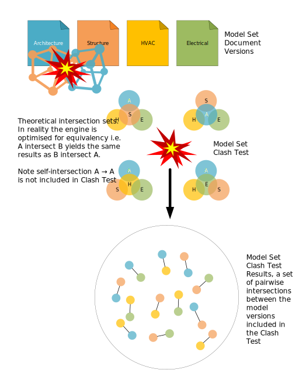
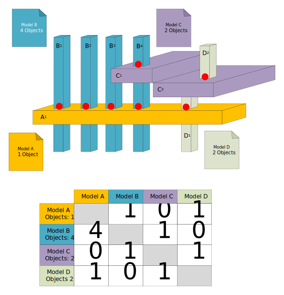

# Model Coordination Clash Testing

## Clash Testing

The Model Coordination clash service generates raw clash results by pairwise intersection of all the documents in a [Model Set Version](model_sets.md). At the raw clash level Model A ∩ Model B is equivalent to Model B ∩ Model A. Clash Tests are executed for every [Model Set Version](model_sets.md) created by the system

## Clash Grouping

The matrix breakdown of Clash Tests presented in the BIM 360 Model Coordination application is a specialised form of filtering and grouping which can be applied to raw Clash Test results. In the matrix view both dimensions (sides) of the matrix are the same so therefore the clash data are symmetrical. Intersections have direction and because both the axis of the matrix are the same dimension it is possible to filter the results of each intersection using the direction of the relationship. In the following example 4 models A, B, C and D are intersected. Models A and C have one object each, Model D has two objects and Model B has four distinct objects. These objects are represented by subscripts as follows MODELobject. The intersections (clash) between these models are drawn as red dots and can be described by the following tabulated matrix view.

The clash matrix table should only be interpreted by reading across its columns. Reading each row, the numbers in the table for each column intersection are the counts of the number of objects in the row model which are clashing with the column model. This is effectively a count of the Clash Groups in the row model when it is intersected (∩) with the column model, i.e. the direction of the intersection matters. A ∩ B (read as A intersect B) will yield different set of Clash Groups when compared with B ∩ A (read as B intersect A). In our example :-

> In total model A has 1 object clashing with other models. Model A has 1 Clash Group when intersected with model B, A ∩ B = 1 (A1 → B1, B2, B3, B4), 0 Clash Groups when intersected with model C, A ∩ C = 0 and 1 Clash Group when intersected with model D, A ∩ D (A1 → D2).

> In total model B has 4 objects clashing with other models. Model B has 4 Clash Groups when intersected with Model A, B ∩ A = 4 (B1 → A1, B2 → A1, B3 → A1, B4 → A1), 1 Clash Group when intersected with model C, B ∩ C = 1, (B4 → C1) and 0 Clash Groups when intersected with model D, B ∩ D = 0

> In total model C has 2 objects clashing with other models. Model C has 0 Clash Groups when intersected with model A, C ∩ A = 0, 1 Clash Group when intersected with model B, C ∩ B = 1 (C1 → B4) and 1 Clash Group when intersected with model D, C ∩ D (C1 → D1).

> In total model D has 2 objects clashing with other models. Model D has 1 clash Group when intersected with model A, D ∩ A = 1 (D2 → A1), 0 Clash Groups when intersected with model B, D ∩ B = 0 and 1 Clash Group when intersected with model C, D ∩ C = 1 (D1 → C2)

The numbers in RED in the table above are counts of the total number of objects in the row model which are clashing with all the other column models in the intersection matrix. Confusingly this total must not be interpreted as the row total of the Clash Groups presented in the matrix as this number is an individual object count and the numbers presented in the matrix are counts of the individual Clash Groups (groups of objects). Thus in our example the total number of objects in model B which are clashing with other models, 4 does not equal (B ∩ A) + (B ∩ C) + (B ∩ D) = 5 (4 + 1 + 0).

---
[back](../README.md)