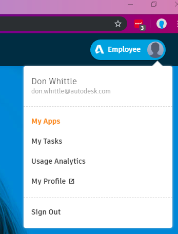
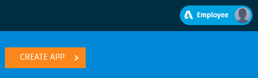
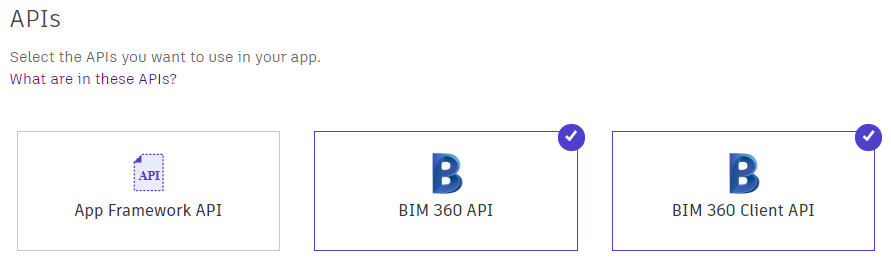
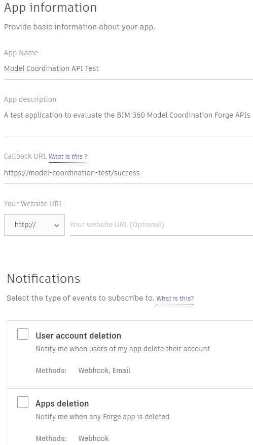
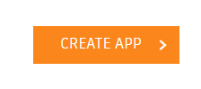
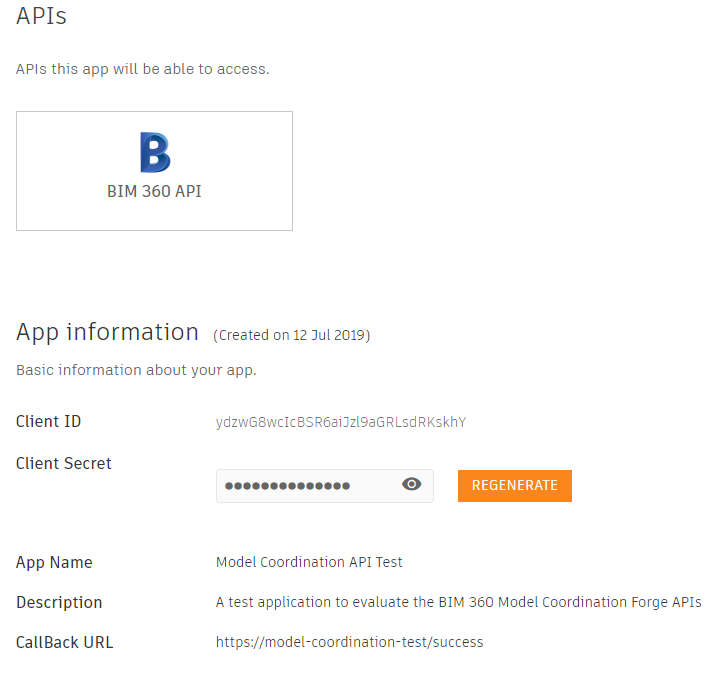
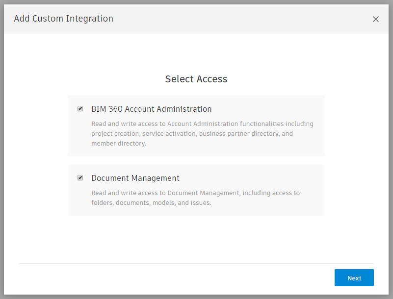
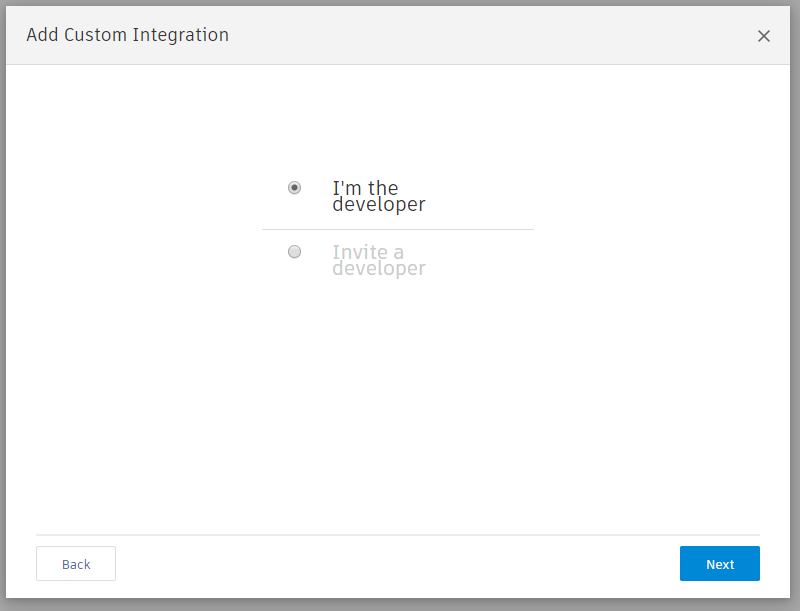
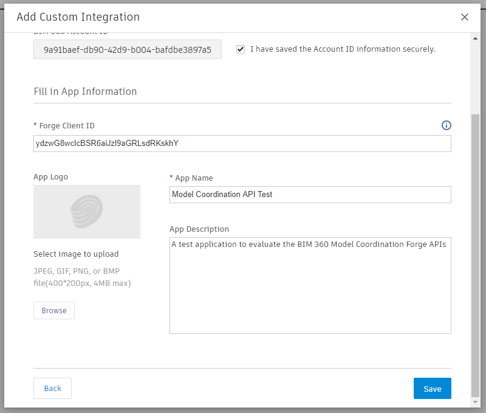
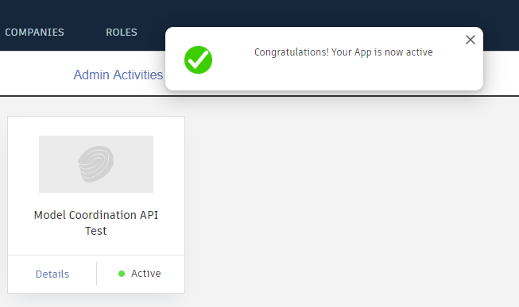

# Getting Started

Before you can get started with the BIM 360 Model Coordination APIs samples included in this repo you will need to perform the following two tashks :-

- create an _Application_ on Forge.
- Grant your application access to your BIM 360 Account.

## Creating a Forge Application

### Step 1. Sign into Forge and create an Application

Go to [Forge](https://forge.autodesk.com) and sign in. If you have not created an account do so now. If you have previously created an application you just need to check if you have access to the appropriate APIs (see Step 2 below). If your existing application is missing these APIs unfortunately you will need to create a new application as Forge does not currently support changing the APIs registered against an existing Application Client ID. It is good practice however when splunking around with new APIs not to re-use a Client ID which you may be using in production environments.

When you are signed into forge as a valid user you will see the menu button in the top right-hand corner of the page, click on My Apps. 

Hit _Create App >_

### Step 2. Select the required API access

As noted above it is not possible to edit the APIs registered against the application you are creating once you have created it. Make sure you select _BIM 360 API_ AND _BIM 360 Client API_. 

### Step 3. Supply the application details

Now fill in your application details. The essential fields are "App Name", "App Description" and "Callback URL". The Value you supply for Callback URL does need to have  valid URL syntax however it does not need to exist. Example valid URLs are "https://mycompany.com/success", "https://forge-app-testing/ok" etc. If you are building a web application using Forge Authentication this URL should be set to the page in you application that you want users to be re-directed to following a successful sign-in against Forge.

Hit _Create APP_

### Success!

If application creation was successful you will see the details you entered in the form along with the Forge _Client ID_ and _Client Secret_. You will need these two strings to sign into Forge and use the APIs. For more information see the Forge authentication [Field Guide](https://stg.forge.autodesk.com/en/docs/oauth/v2/developers_guide/field-guide/) and [Get a 3-Legged Token with Authorization Code Grant](https://stg.forge.autodesk.com/en/docs/oauth/v2/tutorials/get-3-legged-token/) step-by-step tutorial. You can also find more detailed documentation relating to Forge application creation [here](https://stg.forge.autodesk.com/en/docs/oauth/v2/tutorials/create-app/).

## Granting Forge API Access to your BIM 360 Account

### Step 1. Sign into BIM 360 Account Administration

An Account Administrator will need to sign into BIM 360 and navigate to the _Settings_ `->` _Custom Integrations_ tab. This tab is _NOT_ enabled by default! If you or  your administrator cannot see this tab you will need to contact your Account manager to enable the Forge custom integrations tab for your account. Assuming custom integrations are enabled hit the _Add Custom Integration_ button.

### Step 2. Select the level of Access Required

If you are going to be automating anything other that BIM 360 Docs, make sure the _BIM 360 Account Administration_ checkbox is selected. This will enable automated project creation etc. Granting Account Administration access will give anyone with the Client ID and Secret the ability to call your BIM 360 Account Adminstration API. If you are employing 3rd party developers then you should make sure you fully understand the level of access you require. That said this choice only controls whether or not the Client ID you have generated has permission to call these APIs. The actual permissions of the caller will be determined by their user identity and the permissions they have been granted by administrators of the system.

### Step 3. Are you the Developer or an Administrator acting on behalf of a Developer?

If you are an Account Administrator acting in response to a request from a developer who is not an Account Administrator you can select _Invite a Developer_ in the following options dialog to give a developer temporary access to create a custom integration without making them an Account Administrator.

### Step 4. Create the custom integration

Check the box which states _I have saved the Account ID information securely_. The GUID in the grey text box is the GUID for your account you will need this in API calls which require an `account_id` value. If you have not done so make a note of this GUID somewhere. For consistency it is recommended you use the same name and description you supplied when initially creating your Forge Application (Step 3 in _Creating a Forge Application_).

Hit _Save_.

### Success

If you custom integration was registered successfully you will see a toast message to that effect and you should see a tile for you newly registered application under the custom integrations tab.

---
[back](../README.md)