# Initializing The Model Coordination Container

There is currently a limitation in the BIM 360 Model Coordination Application meaning the APIs will not be accessible on a new blank BIM 360 projects until the first model set has been defined by a project administrator. Essentially until the administrative process of creating the first collaboration space (model set) initializes the model set service container. This limitation is slated to be removed in a future release of the application when BIM 360 HQ (Admin) assumes responsibility for initializing service containers for BIM 360 projects. In the short term however, if you are running these samples against a brand new blank BIM 360 project you will need to manually set-up a _"dummy"_ collaboration space (model set) as follows :-

## Create Coordination Space (Model Set)

First in BIM 360 Document Management create a new folder under the `Plans` folder root.

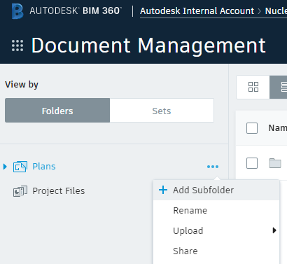

Create a folder called `MC_API_INIT`

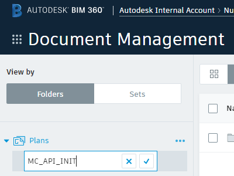

Switch to `Project Admin`

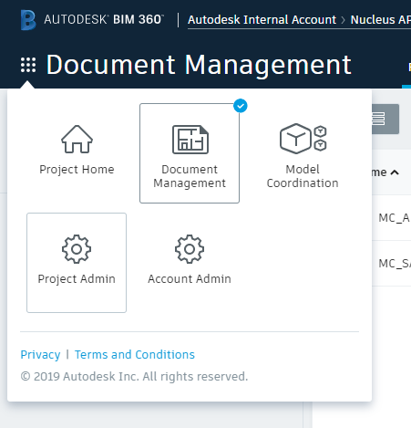

And open the `Model Coordination` tab, click on the `Create` coordination space button.

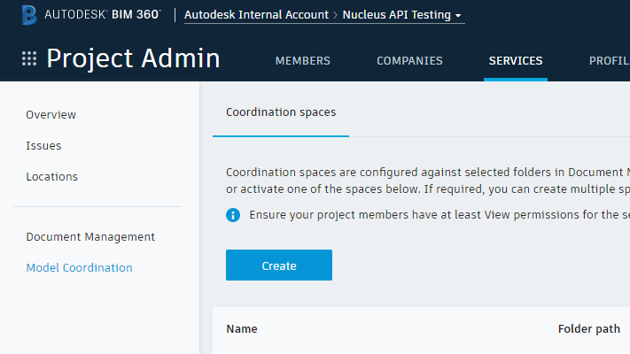

Browse to the `MC_API_INIT` folder in the folder browser and use the `MC_API_INIT` as the name of your coordination space, click `Create`

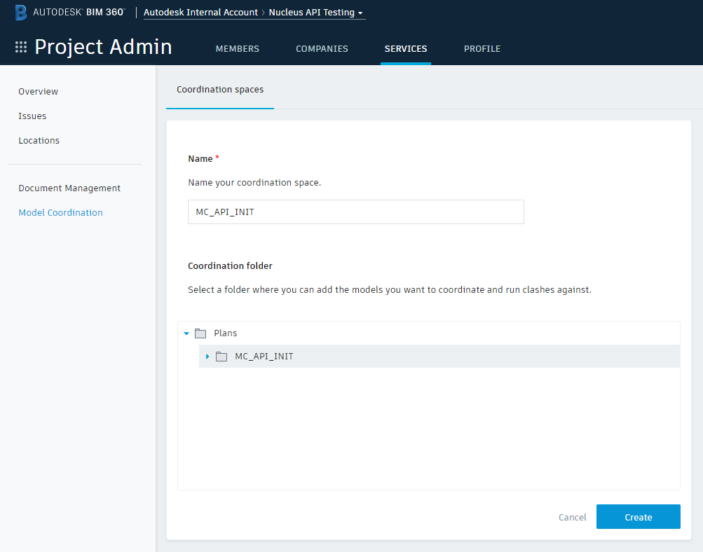

You will see gears spinning while the underlying model set container is created.

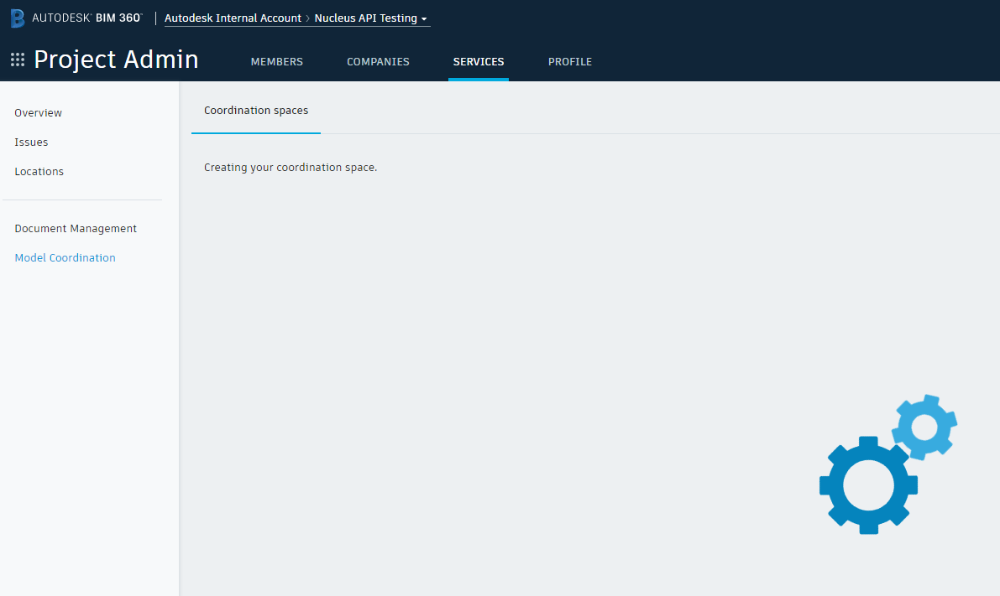

When this is succeeded you will see the new coordination space (model set).

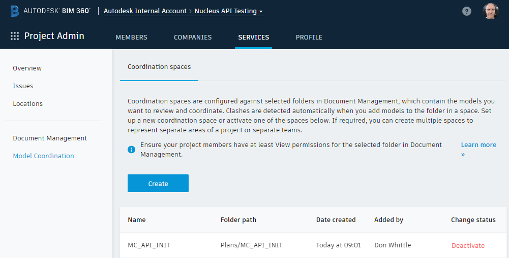

Switch to `Model Coordination` to conform the container is properly initialised.

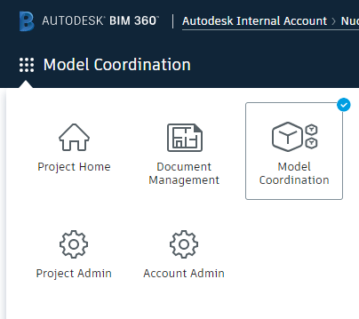

You should see a blank page telling you to upload models.

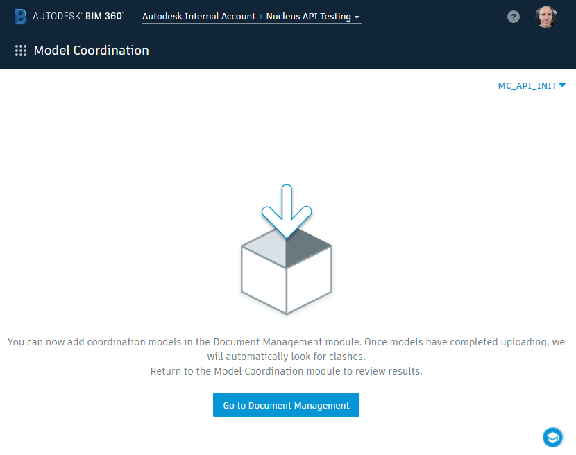

## Deactivate Coordination Space (Model Set)

It is now safe to delete this coordination space. These steps are not necessary for the samples in this repo to execute successfully, they demonstrate how to disable a model set. Start by deleting the `MC_API_INIT` folder in `Document Management`

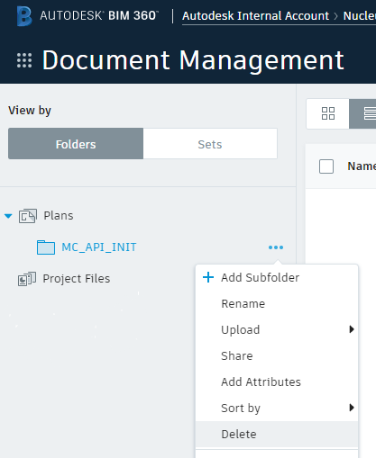

Make sure you are removing the right folder ;-)

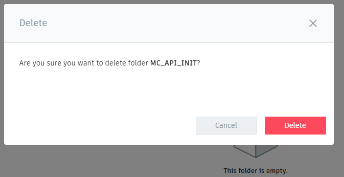

Back in `Model Coordination` adminstration click on `Deactivate` in the status column of the associated `MC_API_INIT` row in the coordination space table.

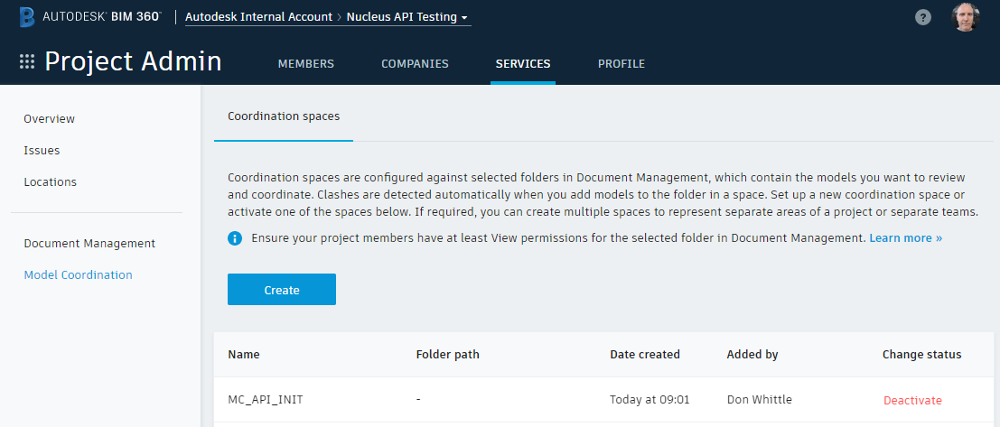

Again make sure you're doing the right thing, a little paranoia never hurt anyone right?

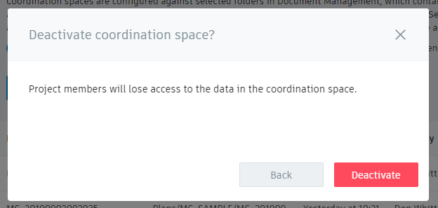

If successful you will see the `MC_API_INIT` coordination space is no longer active

