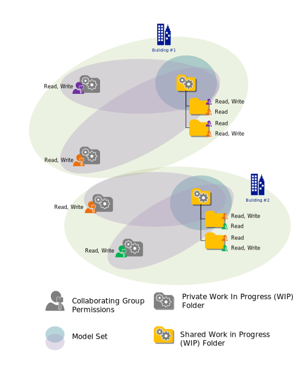
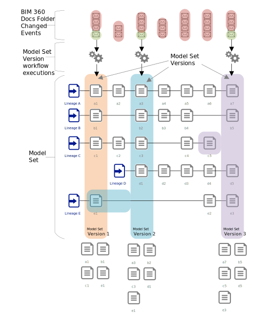

# Model Coordination Model Sets

## Containers vs. BIM 360 Projects

BIM 360 Data Services e.g. the Model Coordination Services or the BIM 360 Issues Service use Containers as the primary data partition for all the service data associated with a specific Project and or Account. There does not need to be a 1:1 relationship between Containers and Projects, i.e. a Container may hold data for multiple Projects associated with an Account. However, for all practical purposes there typically is a 1:1 relationship. How Data Service Containers get created in BIM 360 projects is somewhat varied. In the case of Model Coordination they are lazily created by Model Coordination Project Administrators when they use the BIM 360 Model Coordination Web Application to configure Model Sets.

## Model Set

A Model Set is the _unit of coordination_ in BIM 360 Model Coordination. A Model Set is a collection of BIM 360 Docs Folder URNs along with a optional set of content filters. Model sets define access control permissions to BIM 360 Model Coordination and they dictate the creation of Model Set Versions. Before going on to explain Model Set Versions in more detail in the next section is important to understand how BIM 360 Docs Project and Folder permissions are used for Model Coordination access control.

In the fictional Project illustrated below there are two buildings being designed. The design files (RVTs, DWGs, IFC. etc.) are being uploaded to Folders in BIM 360 Docs by the different trades collaborating on the project. These collaborating trades are represented using colour, with each colour representing a fictional trade (Architect, Structural Contractor, HVAC contractor etc.). In BIM 360 Docs access control is implemented at the Folder level. Once users have been made members of a Project they are given fine grained access to folders either directly or through their membership of Groups defined by the Project Administrator.

The example below describes a simplification of the Docs permission model with *read* indicating a user can list and view the content of a folder and *write* meaning a user can copy, move, upload or delete content to or from a folder. Each trade has read/write access to a "private" Work In Progress (WIP) Folder and either read only or read/write access to a "shared" WIP Folder. When users are ready to share and coordinate their designs with collaborators they copy Documents into the shared folders, at which point the trades they are working with can get access to these copies of the data.

There are six Model Sets configured in this Project, these are represented by the coloured ellipses overlapping the Folders in the diagram. There is one Mode Set for each of the shared WIP folders consisting of the shared folder tree and one Model Set for each private WIP folder. These private Model Sets encompass not only the individual private WIP Folders, but also the corresponding shared WIP Folder tree. In Model Coordination terms the dedicated Model Sets for each of the shared WIP Folder are used to coordinate the latest shared or published designs in the Projects, whereas the intersection of these folders with the private WIP Folders of the trades allows each trade to coordinate their _latest_ design versions against the versions of the designs published to the shared folders by other collaborating trades.

## Model Set Versions

Once defined the Model Coordination Model Set service automatically creates Model Set Versions to represent the content contained by a Mode Set. A Model Set Version is simply the collection of 3D design Document versions found in the Folders of a given Model Set at a given point in time. Once calculated this set is persisted by the Model Set Service and is then available for use in coordination workflows, e.g. clash detection. Model Set Versions are created by sampling the Documents in BIM 360 Docs in response to the system receiving _Folder Changed_ events from BIM 360 Docs as users upload, move, delete and copy content to a from Folders. This is illustrated in the following diagram

The system is continuously receiving _Folder Changed_ events from BIM 360 Docs. In response to these events the Model Set Service first checks to see if the Folder it has been notified about is contained in any Model Sets configured by users of the system. If the Folder is not participating in a Model Set then no further processing takes place. If the Folder is participating in 1 or more Model Sets the Model Set Services will proceed to calculate and persist the Document version list for each Model Set. This is achieved by recursively scanning the set of Folders in each Model Set to find the tip (latest) version of the 3D model Documents encompassed by the Folders which make up the Model Set definition. The Model Coordination Model Set Service ensures that where two Documents are different versions of the same design the latest is always selected for inclusion in the Model Set Version. Thus in the example above the private latest WIP version of the design will be selected over an older version of this design copied into a shared WIP folder.

The diagram above also illustrates a limitation in the current implementation of the Model Set Service, namely not every combination of latest Document versions will make it into a specific Model Set Version. BIM 360 Docs is a multi-user system and as such at any point in time multiple users can be changing the content of individual Folders in a Project. It is possible for a user to change the composition of a Folder in a Model Set _after_ the Model Set Service has scanned it for it's latest Document versions but _before_ this Model Set Version is persisted by the service. The Model Set Service does not abandon a Model Set Version if it receives a new Folder changed notification in the middle of its processing of a new Model Set Version, instead this signal is temporarily ignored until the current Model Set Version Folder scan has completed. In logical terms Model Set Versions are serialised for a Model Set, i.e. for any given Model Set a new Document version scan cannot be started until the proceeding scan has finished. The Model Set Service does however guarantee to become _eventually consistent_ with the latest, tip versions of the Documents in the system if users stop changing content. The time this takes will be dependent on the sze of a project and the number of users making changes to the model content in the Project through time.

---
[back](../README.md)