# Using Postman to Obtain Forge OAuth Tokens

Open the environment manager

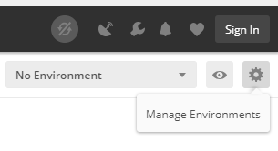

Click on `Import`

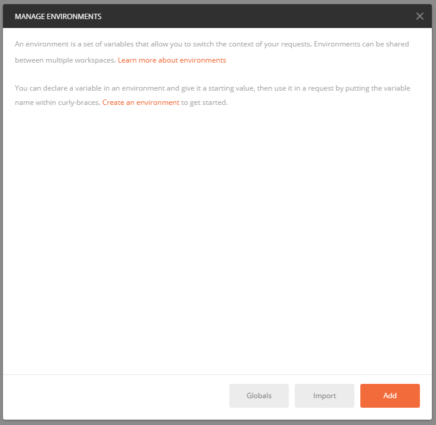

Click on `Choose Files`

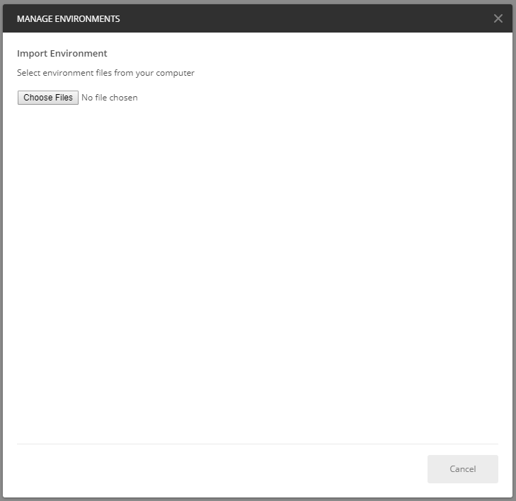

Browse to `./tools/postman/env/autodesk-forge-prod.postman_environment.json` and hit `Open`

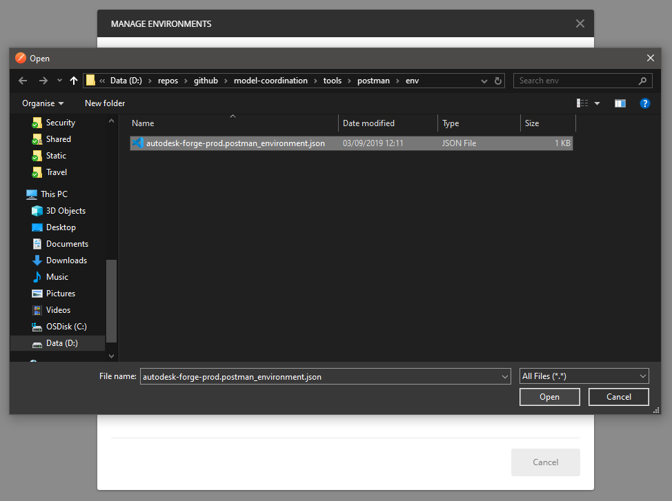

This should add a `Autodesk Forge PROD` environment to your current postman session. Close the dialog box to return to the main window.

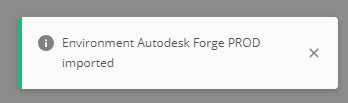

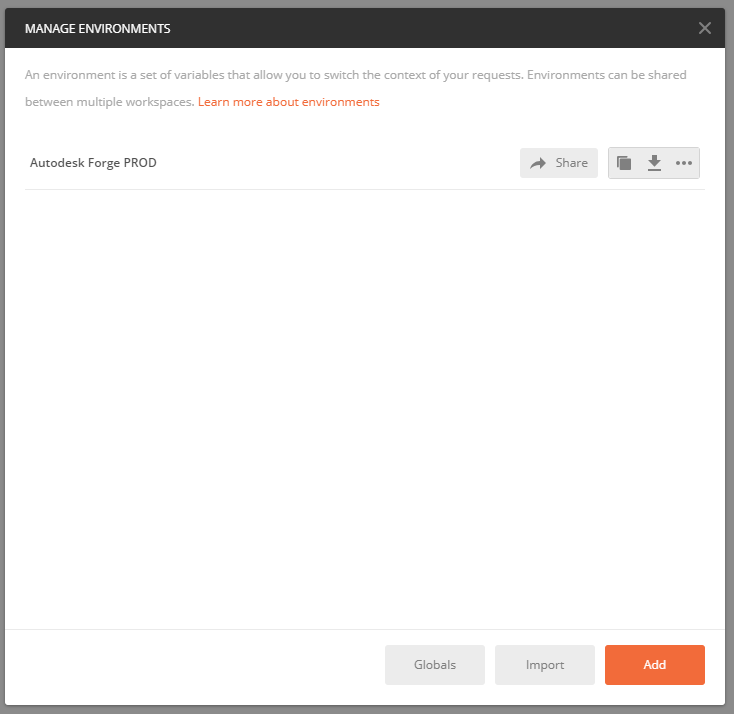

Select the `Autodesk Forge PROD` environment in the drop-down in the top right-hand corner of the postman main window and then ues the _eye_ icon to the right of the drop-down to view the environment variables, click on the `Edit` button to edit the current values.

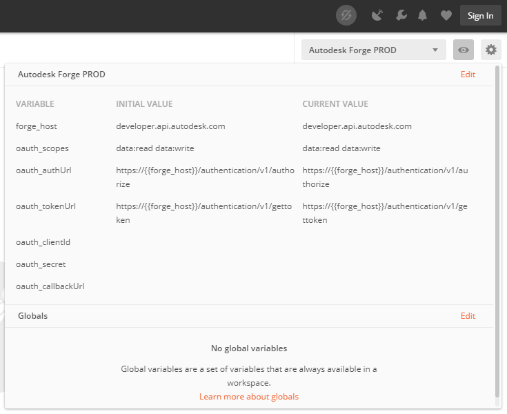

Add the values `oauth_clientId`, `oauth_secret` and `oauth_callbackUrl` for your Forge App. When you have set these values, hit `Reset All` to update the current vlaues for the environment and finally save your changes by pressing the `Update` button.

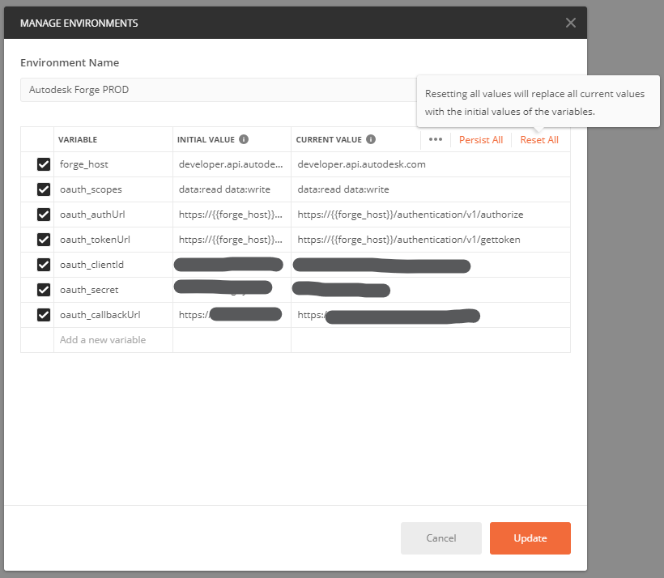

Back in the main postman window choose `File` -> `Import...` to open the postman import dialog.

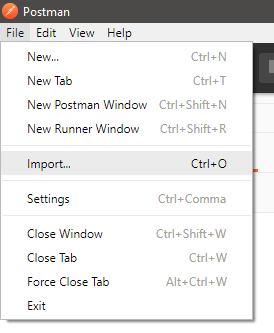

Make sure the `Import File` tab is selected and then press `Choose Files`...

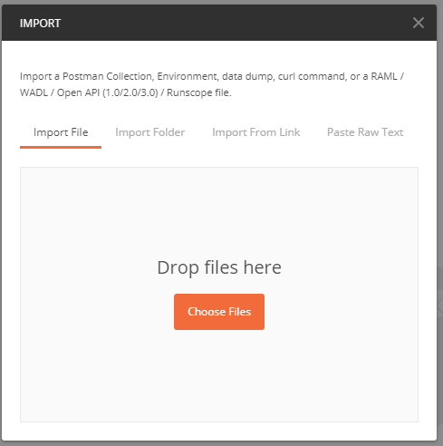

Browse to `./tools/postman/collection/forge-authentication.postman_collection.json` and click `Open`.

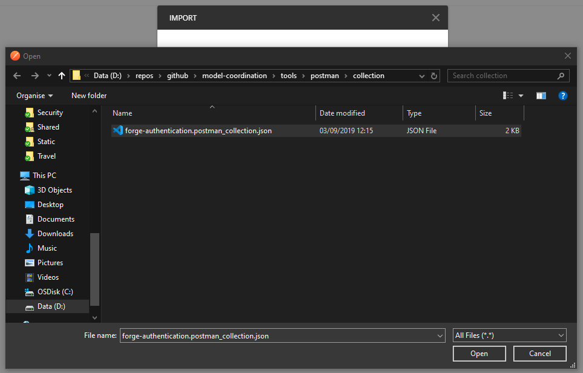

This should add a `Forge Authentication` collection to postman. Expand the collection menu and select `Edit`.

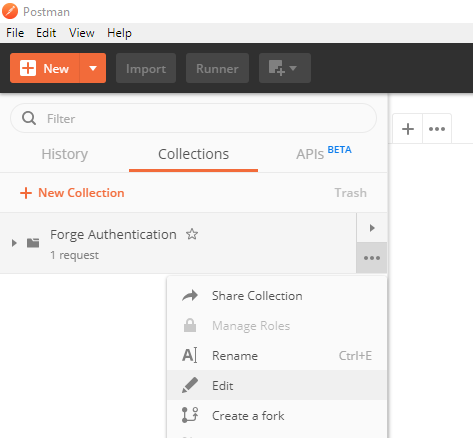

On the `Authorization` tab select `OAuth 2.0` in the `TYPE` drop-down and `Request Headers` in the `Add auth data to` drop-down, now click `Get New Access Token`

Make sure the environment variables have been assigned to their corresponding input parameters. Ensure the `Grant Type` drop-down is set to `Authorization Code` and the `Client Authentication` drop-down is set to `Send client credentials in body`, finally click `Request Token`.

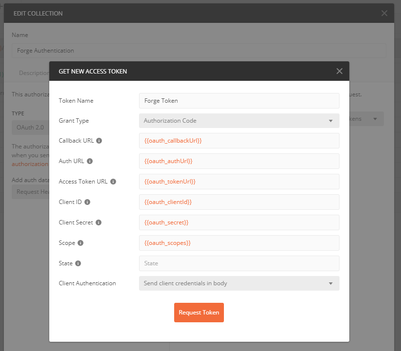

You should be presented with the standard Autodesk Forge sign in dialog, enter a valid user name...

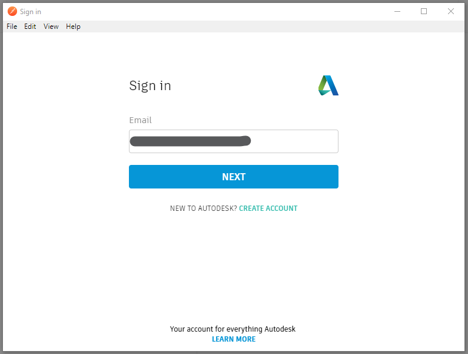

... and password, making sure to check the `Stay signed in` check-box option.

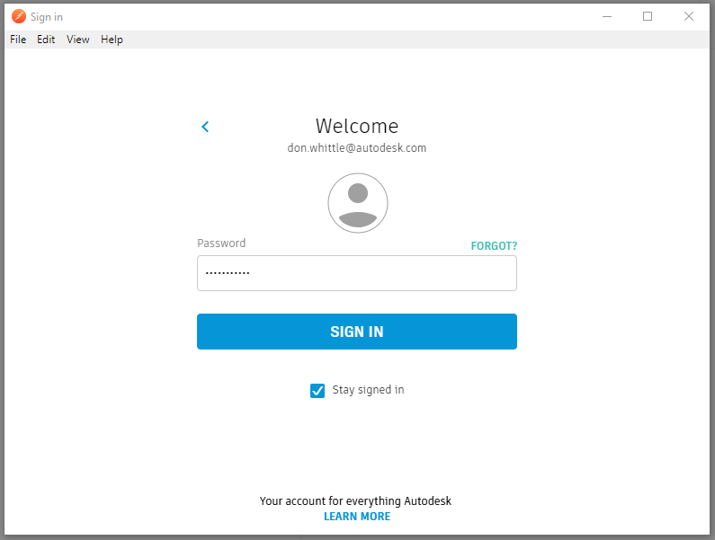

If successful you will be presented with a new token in the token manager. You can now copy the `Access Token` and use [MCConfig](../tools/dotnet/src/MCConfig/README.md) to set this token (use the `Set cached Forge App auth token` option). Finally copy the value of `refresh_token` to the clip-board and click the `Use Token` button, you may have to scroll to teh bottom of the dialog to see this button.

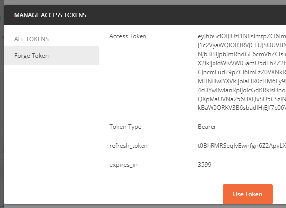

You can continue to return to the token manager by using the `Edit` option on the collection menu. Assuming you have copied the `refresh_token` value from the token manager click the `Update` button to close the collection details dialog.

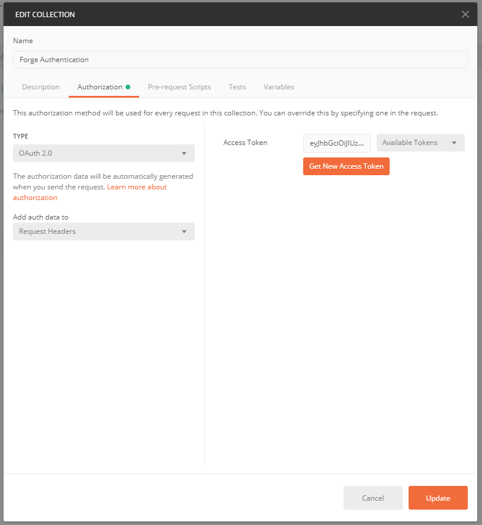

Now select the `POST Refresh Token` request under the `Forge Authentication` collection and select the `Body` tab of the request. Paste the refresh token value you copied in the previous step into the `refresh_token` x-www-form-urlencoded key and click `Send` on the request.

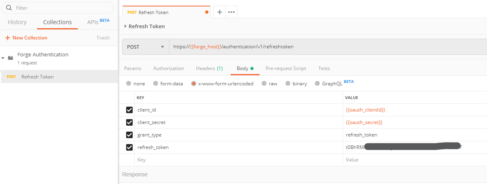

If successful you will have made a token refresh request to Forge and you will see a new auth token and refresh token in the JSON response body. You can keep substituting the new refresh token you obtain back into the body of the request to continue to get new tokens as they expire.

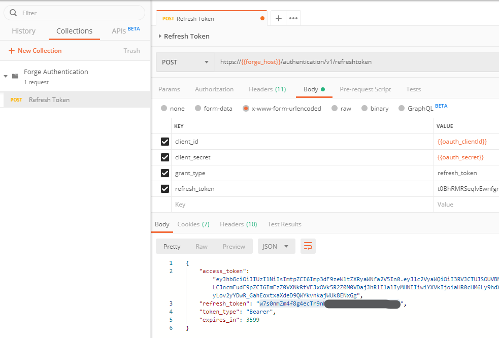