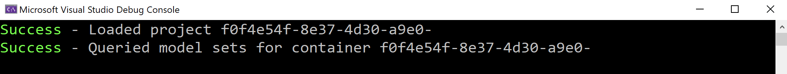

# Test Environment Setup

## Description
This code will check if the logged user (by the 3legged token) can access BIM 360 hub and project(also entry of model coordination).

## Steps
1. Ensure dependent packages of nuGet have been installed, and the dependent project [Forge](../samples/auxiliary/Forge) has been built and imported successfully. 
2. Ensure ` SampleConfiguration.json ` has been configured with _hub id_, _project id_ and _valid token_. Please check [RuntimeConfig.md](../RuntimeConfig.md) on how to generate ` SampleConfiguration.json `.
3. Build the sample and run.
4. The code will try to access BIM 360 hub, project and services of model coordination. If everything works well, it will print out the message with success.

  

   

