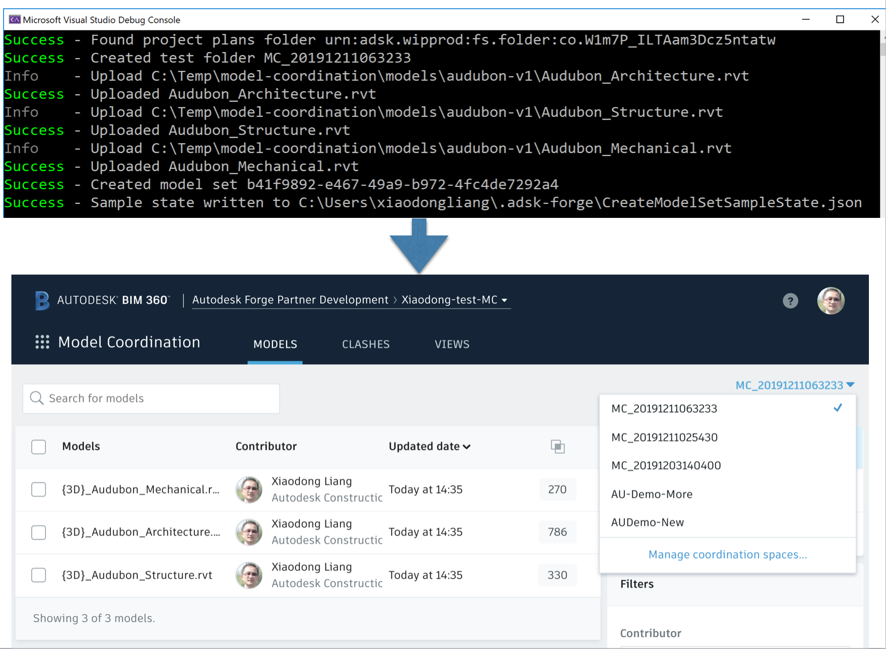
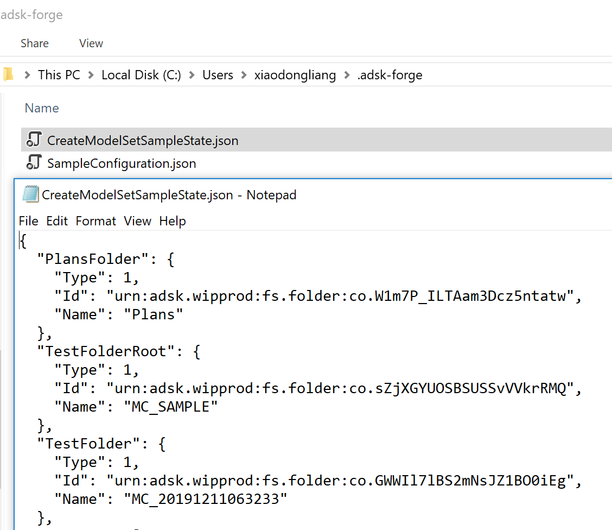

# Create Model Set

## Description
This sample will create one model set from the specific folder with some demo Revit files. 

## Steps
1. Ensure dependent packages of nuGet have been installed, and dependent project [Forge ](./samples/auxiliary/Forge) has been built and imported sucessfully. 
2. Ensure ` SampleConfiguration.json ` has been configured with _hub id_, _project id_ and _valid token_. Please check [RuntimeConfig.md](../RuntimeConfig.md) on how to generate ` SampleConfiguration.json `.
3. [models](../models) provides two versions of demo files. The code uploads _version 1_ by default. If you want to play with _version 2_, please update the code line at [Program.cs]().
Note: This code does not use resumable uploading. If you want to test with large models, please use other tools/codes to resumable upload.
4. Build the sample and run.
5. The code will create one subfolder under **Plan** folder in BIM 360 project firstly. The demo Revit files will be uploaded to this sub older. Finally, the code will create a **model set** from this subfolder. If everything works well, it will print out the message with success.

  

   

A json file ` CreateModelSetSampleState.json ` will be generated in user's default profile directory. It contains the response of creating a model set. This will be a prerequistie of the next sample tests.

  

   

6. Wait for some time until the process of coordination completes. And you can test other samples.
