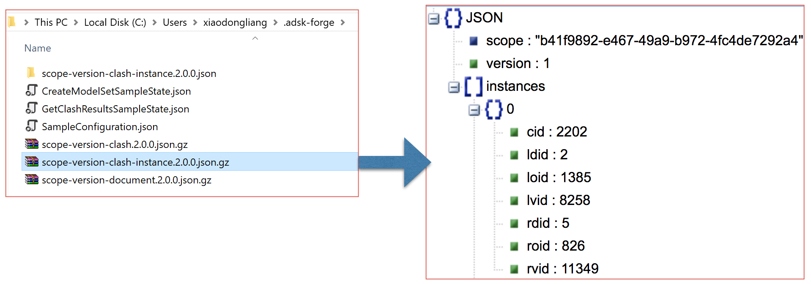

# Get Clash Result of Modelset

## Description
This sample will get detail clash data of one coordination of modelset, including documents list, clash list and clash instance list. This modelset is normally created by [2. CreateModelSetSample](./2. CreateModelSetSample.md).

## Steps
1. Ensure dependent packages of nuGet have been installed, and dependenct project [Forge ](../samples/auxiliary/Forge) has been built and imported sucessfully. 
2. Ensure ` SampleConfiguration.json ` has been configured with _hub id_, _project id_ and _valid token_. Please check [RuntimeConfig.md](../RuntimeConfig.md) on how to generate ` SampleConfiguration.json `.
3. Ensure ` CreateModelSetSampleState.json ` is available in user's default profile directory. This json file is generated by the sample [2. CreateModelSetSample](./2. CreateModelSetSample.md).
4. Build the sample and run.
5. The code will get three data:  
  - scope-version-document.2.0.0.json.gz: documents list of this modelset which have clash
  - scope-version-clash.2.0.0.json.gz: clash list of this modelset, including clash id, distance and documents id.
  - scope-version-clash-instance.2.0.0.json.gz: clash instance of this modelset, including clash id, documents id and clash objects id(dbId in Forge Viewer).
 
If everything works well, it will print out the message with success. Unzip the *.gz files to check json data.

  

   

Check [Working with Clash Results](https://forge.autodesk.com/en/docs/bim360/v1/tutorials/model-coordination/mc-tutorial-clash/) for more information.