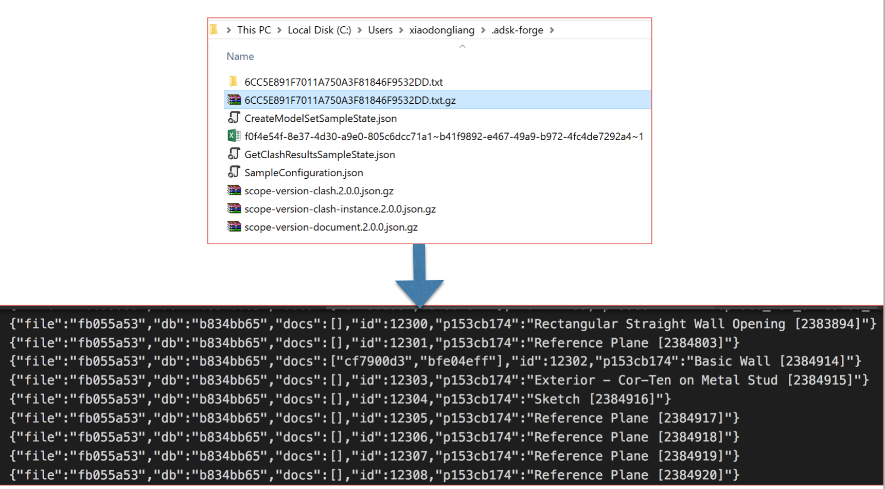

# Get Property Index of Modelset

## Description
This sample will get detail properties index of one coordination of model set, including index manifest and property index (by specific S3 query). This model set is normally created by [2. CreateModelSetSample](./2. CreateModelSetSample.md).

## Steps
1. Ensure dependent packages of nuGet have been installed, and dependenct project [Forge ](../samples/auxiliary/Forge) has been built and imported sucessfully. 
2. Ensure ` SampleConfiguration.json ` has been configured with _hub id_, _project id_ and _valid token_. Please check [RuntimeConfig.md](../RuntimeConfig.md) on how to generate ` SampleConfiguration.json `.
3. Ensure ` CreateModelSetSampleState.json ` is available in user's default profile directory. This json file is generated by the sample [2. CreateModelSetSample](./2. CreateModelSetSample.md).
4. Build the sample and run.
5. The code will posts a S3 request to ask for all properties which meet the condition of S3. If everything works well, it will print out the message with success. Unzip the *.gz files to check json data.

  

   

Note: the result file is NOT in json format by default. 

Check [Model Set Version Indexing](https://forge.autodesk.com/en/docs/bim360/v1/tutorials/model-coordination/mc-tutorial-index-query/) for more information.