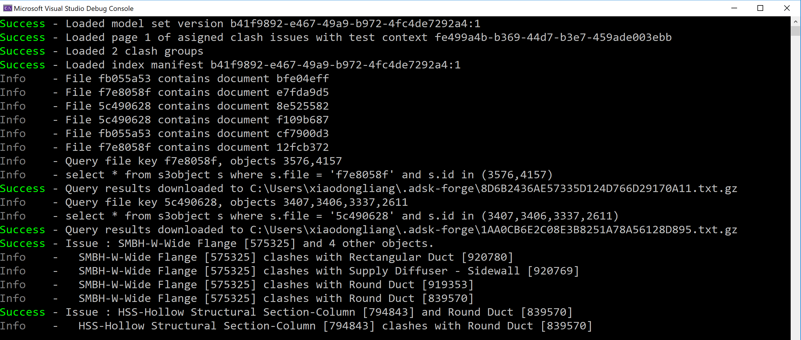

# Classify Clash Objects

## Description
This sample will show a demo on analyzing the clash data, clash issue data and build the information of the clashed objects of the clash issue. It demos the typical workflow of mapping among documents, clash, issue and object properties. 

## Steps
1. Ensure dependent packages of nuGet have been installed, and dependent project [Forge ](../samples/auxiliary/Forge) has been built and imported successfully. 
2. Ensure ` SampleConfiguration.json ` has been configured with _hub id_, _project id_ and _valid token_. Please check [RuntimeConfig.md](../RuntimeConfig.md) on how to generate ` SampleConfiguration.json `.
3. Ensure ` CreateModelSetSampleState.json ` is available in user's default profile directory. This json file is generated by the sample [2. CreateModelSetSample](./2. CreateModelSetSample.md).
4. Build the sample and run.
5. The code will get property index manifest (which contains map between documents and property index) firstly. Next, get clash groups, find out the corresponding documents of the clash, clash data and finally query the index property of the objects. The results of the clash objects information will be generated to the user's default profile directory  

  

   

