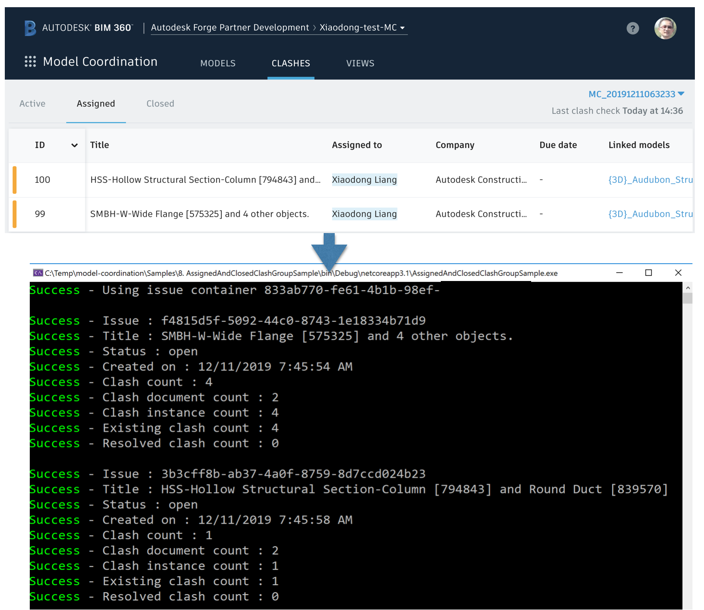

# Get Assigned and Closed Clash Issues

## Description
This sample will get assigned and closed clash issues of one coordination modelset.This modelset is normally created by [2. CreateModelSetSample](./2. CreateModelSetSample.md).

## Steps
1. Ensure dependent packages of nuGet have been installed, and dependenct project [Forge ](./samples/auxiliary/Forge) has been built and imported sucessfully. 
2. Ensure ` SampleConfiguration.json ` has been configured with _hub id_, _project id_ and _valid token_. Please check [RuntimeConfig.md](../RuntimeConfig.md) on how to generate ` SampleConfiguration.json `.
3. Ensure ` CreateModelSetSampleState.json ` is available in user�s default profile directory. This json file is generated by the sample [2. CreateModelSetSample](./2. CreateModelSetSample.md).
4. Ensure some clash issues have been created in UI (or by API). By default, the issues will be assigned. It is optional to close some clash issues, for testing with this sample
4. Build the sample and run.
5. The code will dump assigned and closed issues. If everything works well, it will print out the message with success.

  

   

