# Azure Cosmos DB and Power BI Clash Reporting

### Demonstrates

In this sample we bring together work from previous samples to demonstrate a novel use for the BIM 360 Model Coordination APIs. This App takes the clash results from a model set version and classifies the objects clashing by reading their Revit category, family and type data from the associated model set property index. Once this data set has been constructed it is uploaded to Azure Cosmos DB as a pre-cursor to building a Power BI report which visualises the clash results.

### Environment Dependencies

- A cached OAuth user token has been set
- [TestEnvironmentSetup](../TestEnvironmentSetup/README.md) executed successfully
- [CreateModelSet](../CreateModelSet/README.md) executed successfully
- [QueryModelSet](../QueryModelSet/README.md) executed successfully
- [QueryClashTestResults](../QueryClashTestResults/README.md) executed successfully
- [QueryModelSetVersionIndex](../QueryModelSetVersionIndex/README.md) executed successfully

### Getting ready in Azure

Before you can run this sample you will need access to a [Microsoft Azure Account](https://azure.microsoft.com/en-gb/features/azure-portal/).

Once you have access to an Azure Account this sample relies on a Cosmos DB Account. If you have not provisioned a Cosmos an Account in your Azure subscription you can follow this tutorial ["Build a .NET console app to manage data in Azure Cosmos DB SQL API account"](https://docs.microsoft.com/en-us/azure/cosmos-db/sql-api-get-started). This will step you through Cosmos account creation and show you how to programmatically upload data to Cosmos. 

*** WARNING ***

You do _NOT_ need to create a Cosmos Database or Container as the sample code does this for you. If you do not want the sample to do this then you can adjust the constants used for Database and Container by editing the constants in [CosmoRevitClashClient.cs](../MCSample/Model/Cosmos/CosmoRevitClashClient.cs)

```csharp
    [Export(typeof(ICosmoRevitClashClient))]
    internal sealed class CosmoRevitClashClient : ICosmoRevitClashClient
    {
        private const string DatabseId = "Clash";

        private const string ContainerId = "Results";
```

By default this sample App creates a database called `Clash` with a container in this database called `Results`.

### Configuring Cosmos Account Locally using MCConfig

Before you can run the sample you will need to configure the sample with your Cosmos Account URL and PrimaryKey. You can obtain these values from the Azure portal by browsing to you Cosmos Account and clicking on the Keys tab :-

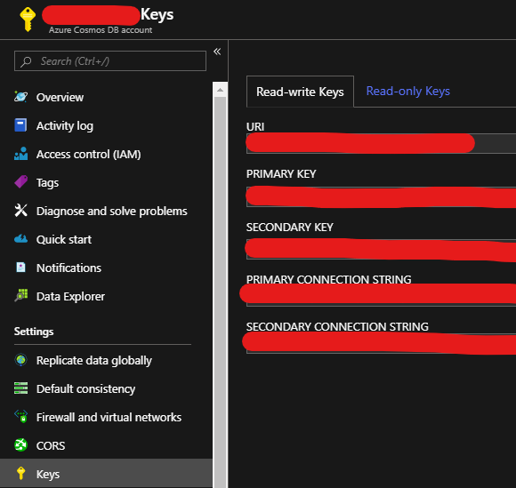

Once you have the `URI` and `PRIMARY KEY` from the Azure portal you can configure lour local development environment using [MCConfig](../../../../tools/dotnet/src/MCConfig/README.md). Use the `Configure Azure Cosmos DB Account` option. This will prompt you for the Account URI and Primary Key. This command writes the following file :-

```powershell
PS > [System.IO.Path]::Combine([System.Environment]::GetFolderPath('UserProfile'), '.nucleus', 'Cosmos')
```

### Build and Run

```powershell
 PS > cd .\sample\dotnet\src\CosmoDbUploader
 PS > dotnet restore
 PS > dotnet build
 PS > dotnet run
```

### Code Walk-through

The [RevitClashReportBuilder.cs](../MCSample/Model/Cosmos/RevitClashReportBuilder.cs) is used to build a collection of [RevitClashReport.cs](../MCSample/Model/Cosmos/RevitClashReport.cs) instances.

```csharp
var reportBuilder = ctx.ExportService<IRevitClashReportBuilder>();

IReadOnlyCollection<RevitClashReport> reports = null;

await ConsoleExt.DoConsoleAction(async () =>
{
    reports = await reportBuilder.Build(clashState.Container, clashState.Latest.ModelSetId, (uint)clashState.Latest.ModelSetVersion, clashState.Latest.Id);
},
$"BUILD Revit clash report");
```

[RevitClashReport.cs](../MCSample/Model/Cosmos/RevitClashReport.cs) is a simple flat data contract which can be serialised directly into Cosmos DB. The only subtilty to this data contract is the Newtonsoft JSON markup on the ClashId. This results in this property being serialised with a name o f `id`. When Cosmos DB sees this `id` property it will automatically use its value as the object id within the container partition (more on this below).

```csharp
    [JsonProperty(PropertyName = "id")]
    public string ClashId { get; set; }
```

The [RevitClashReportBuilder.cs](../MCSample/Model/Cosmos/RevitClashReportBuilder.cs) `Build` method essentially wraps code we have previously encountered in proceeding samples. 

```csharp
async Task<IReadOnlyCollection<RevitClashReport>> Build(Guid container, Guid modelSetId, uint verison, Guid clashTestId)
```

The clash report rows are returned in a list :-

```csharp
List<RevitClashReport> reportSet = new List<RevitClashReport>();
```

First get the model set version we are going to report on, passed in in the call to `Build`

```csharp
var modelSetVersion = await _modelSetClient.GetModelSetVersion(container, modelSetId, verison);
```

Then get the clash test, also passed in in the call to `Build`

```csharp
var clashTest = await _clashClient.GetModelSetClashTest(container, clashTestId);
```

Now pull the resources associated with the clash test (see the [Working With Clash Results Sample](../QueryClashTestResults/README.md) for more information).

```csharp
var clashTestResources = await _clashClient.GetModelSetClashTestResources(container, clashTestId);

var documentIndex = (await GetDocumentIndex(clashTestResources.Resources.Where(r => r.Type == "scope-version-document.2.0.0").Single()))
    .ToDictionary(i => i.Key, v => new ViewableDocument
    {
        Index = v.Key,
        VersionUrn = v.Value,
        ViewableId = modelSetVersion.DocumentVersions.SingleOrDefault(d => d.VersionUrn.Equals(v.Value))?.ViewableId,
        SeedFileUrn = modelSetVersion.DocumentVersions.SingleOrDefault(d => d.VersionUrn.Equals(v.Value))?.OriginalSeedFileVersionUrn
    });

var clashes = await GetClashes(clashTestResources.Resources.Where(r => r.Type == "scope-version-clash.2.0.0").Single());

var clashInstances = await GetClashInstances(clashTestResources.Resources.Where(r => r.Type == "scope-version-clash-instance.2.0.0").Single());
```

The [RevitObjectQuery.cs](../MCSample/Model/Cosmos/RevitObjectQuery.cs) helper class encapsulates the following S3 Select query against the model set version index: -

```sql
select s.file, s.db, s.docs, s.id, s.p153cb174 as name, s.p20d8441e as cat, s.p30db51f9 as fam, s.p13b6b3a0 as typ from s3object s
```

[RevitObjectQuery.cs](../MCSample/Model/Cosmos/RevitObjectQuery.cs) runs this query and does the heavy lifting to parses the results into the objects stored in `revitObjects`.

```csharp
    var revitObjects = await _revitQuery.GetRevitObjects(container, modelSetVersion);
```

First it runs the query and uses the model set version index manifest to create a dictionary of `Dictionary<string, RevitObject[]>>` where the dictionary key is the seed file URN. This is a map of Revit objects per seed file URN. It only includes index rows which are viewable, where viewable is defined as `.Where(o => o.DocumentIds != null && o.DocumentIds.Length > 0)`, data rows with `s.docs[]` index manifest document IDs.

```csharp
Manifest = await _indexClient.GetIndexManifest(container, modelSetVersion.ModelSetId, (uint)modelSetVersion.Version);

var viewableFileObjects = objects
    .Where(o => o.DocumentIds != null && o.DocumentIds.Length > 0)
    .Select(o => new
    {
        obj = o,
        urn = Manifest.SeedFiles.Single(f => f.Id == o.File).Urn
    })
    .GroupBy(o => o.urn)
    .ToDictionary(g => g.Key, g => g.Select(i => i.obj).ToArray());
```

Then each Revit object in the `viewableFileObjects` map is patched with a map of the `viewableId` from the model set version index manifest and the integer ID used to represent this viewable on the individual index result row in the `s.docs[]` array.

```csharp
foreach (var obj in viewableFileObjects.Values.SelectMany(arr => arr))
{
    obj.ViewableMap =
        obj.DocumentIds
        .Select(id => Manifest.SeedFiles.Single(f => f.Id == obj.File).Documents.Single(d => d.Id == id))
        .ToDictionary(d => d.ViewableId, d => d.Id, StringComparer.OrdinalIgnoreCase);
}
```

Finally it's just a case of iterating over the clash rows in the `scope-version-clash.2.0.0.json.gz` resource and performing lookups against the `scope-version-clash-instance.2.0.0.json.gz` and `scope-version-document.2.0.0.json.gz` resources. These are intersected with he `revitObjects` collection using the `viewableId` from the documents in the Model Set Version and the `s.docs` array on the individual data rows returned from the model set version index query. When you dig into these extension methods you will 

```csharp
foreach (var clash in clashes.Values)
{
    var clashInstance = clashInstances[clash.Id];

    var report = new RevitClashReport
    {
        Container = container
    };

    reportSet.Add(
        report.ForModelSetVersion(modelSetVersion)
            .ForClash(clash)
            .ForClashTest(clashTest)
            .ForClashInstance(clashInstance, documentIndex)
            .WithRevitData(revitObjects, documentIndex));
}
```

The [CosmoRevitClashClient.cs](../MCSample/Model/Cosmos/CosmoRevitClashClient.cs) which wraps the Microsoft `CosmosClient` is then used to upload the revit clash report rows to Cosmos DB in Azure.

```csharp
var cosmoClient = ctx.ExportService<ICosmoRevitClashClient>();

await cosmoClient.PublishReports(reports);
```

As [mentioned above](#Getting-ready-in-Azure) the [CosmoRevitClashClient.cs](../MCSample/Model/Cosmos/CosmoRevitClashClient.cs) will lazily create a database and container using the constants defined at the top of [CosmoRevitClashClient.cs](../MCSample/Model/Cosmos/CosmoRevitClashClient.cs).

```csharp
public async Task CreateContainerIfNotExists()
{
    using (var client = await GetClient())
    {
        var dbResp = await client.CreateDatabaseIfNotExistsAsync(DatabseId);

        if (dbResp.StatusCode != System.Net.HttpStatusCode.Created &&
            dbResp.StatusCode != System.Net.HttpStatusCode.OK)
        {
            throw new CosmoResponseException<DatabaseResponse>(dbResp);
        }

        var db = dbResp.Database;

        var conResp = await db.CreateContainerIfNotExistsAsync(ContainerId, "/test");

        if (conResp.StatusCode != System.Net.HttpStatusCode.Created &&
            conResp.StatusCode != System.Net.HttpStatusCode.OK)
        {
            throw new CosmoResponseException<ContainerResponse>(conResp);
        }
    }
}
```

The upload code uses the simplest mechanism to add rows to Cosmos. Microsoft recommend that the bulk executor library for Cosmos be used if you are adding significant numbers of rows ([Use bulk executor .NET library to perform bulk operations in Azure Cosmos DB](https://docs.microsoft.com/en-us/azure/cosmos-db/bulk-executor-dot-net)) however for this sample we have swerved this additional complexity. For a production version of this code [CosmoRevitClashClient.cs](../MCSample/Model/Cosmos/CosmoRevitClashClient.cs) should be made to use the bulk executor library.

```csharp
public async Task PublishReports(IReadOnlyCollection<RevitClashReport> reports)
{
    await CreateContainerIfNotExists();

    using (var client = await GetClient())
    {
        var container = client.GetContainer(DatabseId, ContainerId);

        foreach (var report in reports)
        {
            await container.CreateItemAsync<RevitClashReport>(report, new PartitionKey(report.Test.ToString().ToLowerInvariant()));
        }
    }
}
```

All of the clash report rows are uploaded into a partition which uses the clash test GUID as the PartitionKey. The individual row keys use the clash id from the individual clash results in the `scope-version-clash.2.0.0.json.gz` resource. Remember the JSON serialisation markup on the [RevitClashReport.cs](../MCSample/Model/Cosmos/RevitClashReport.cs) translates the `ClashId` property to the `id` property Cosmos uses as the RowKey within the partition. If the sample App executes successfully then you will be able to use the Cosmos Data Explorer to view the rows you have just uploaded.

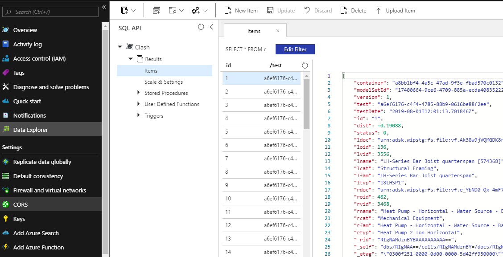

## Building Power BI Reports

### Download Power BI Desktop

To get started building reports in Power BI you first need the [Power BI Desktop Application](https://powerbi.microsoft.com/en-us/desktop/) which can be [downloaded](https://www.microsoft.com/en-us/download/details.aspx?id=45331) from Microsoft.

### Creating a Report

On first launch Power BI desktop will throw up a modal splash. We need to "Get data", so hit the database icon on the left-hand side of the dialog.

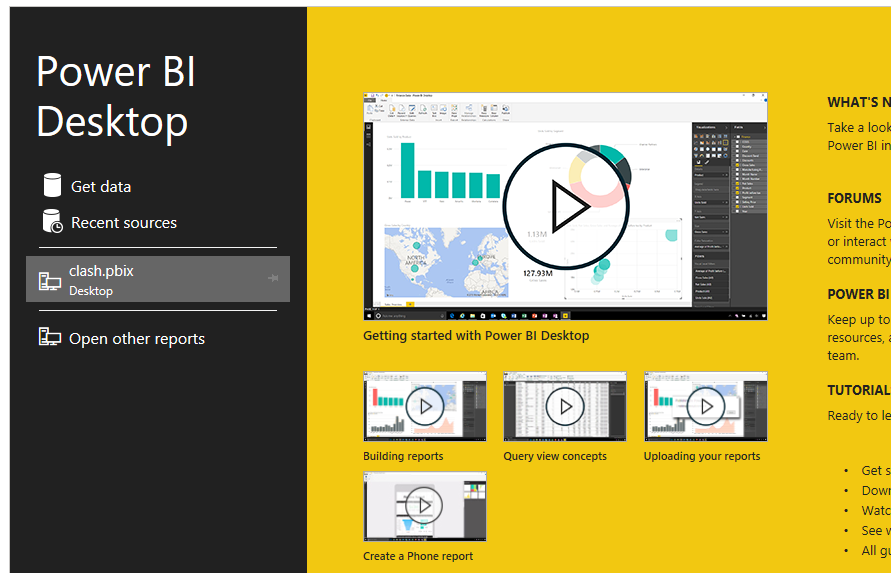

Power BI can work with a multitude of data sources, we want Azure Cosmos DB, select this and hit connect.

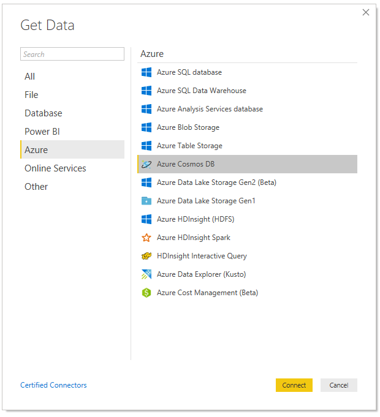

Enter the Cosmos [Account URL you obtained from the Azure portal](#Configuring-Cosmos-Account-Locally-using-MCConfig) and the Primary Key when prompted.

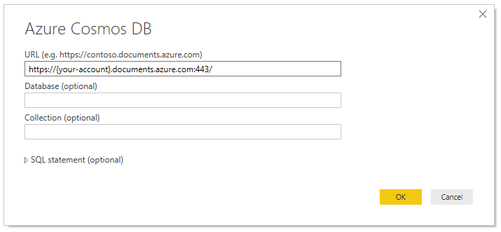

When you are presented with the Navigator, expand the `Clash` database and select the `Results` container, and click `Load`.

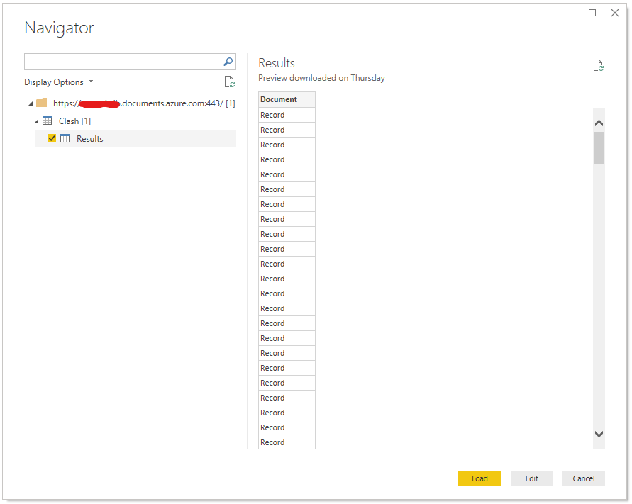

At this point Power BI desktop will dump you into the main application. Before we can work with our report rows in Power BI we need to edit our query against the Cosmos container. Hit the `Edit Queries` button.

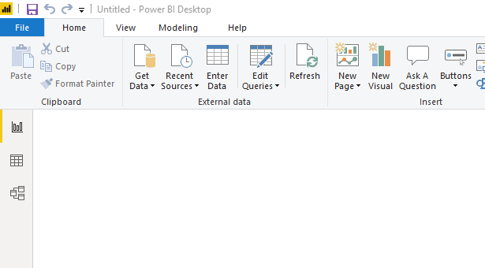

This will open the Power BI Query Builder and you will see the records we pule from the Cosmos Results container presented as a single column of Document data. Remember we uploaded JSON documents to Cosmos, to get at the data we have to _Expand the Document_.

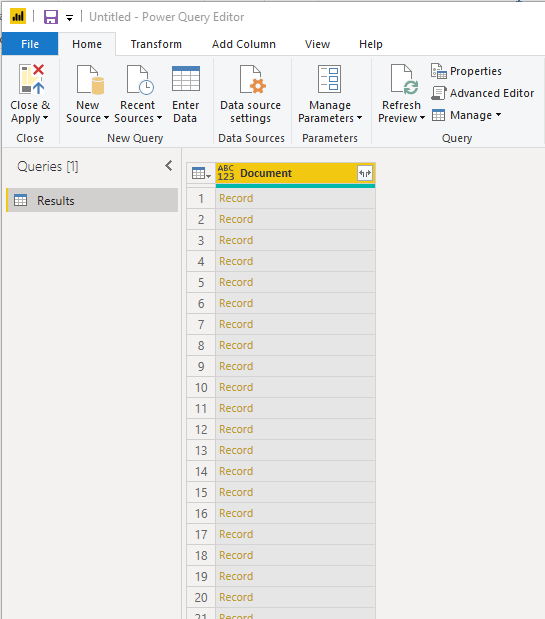

To do this click on the small button to the right of the `Document` column heading

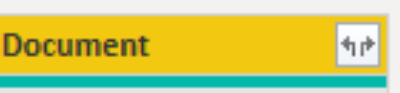

The Query Builder will then scan the JSON in the Cosmos data rows, identify the properties and turn these into a list of columns to add to the Power BI data set. You are not interested in the Cosmos internal consistency properties (prefixed with an `_`) so de-select these and click OK.

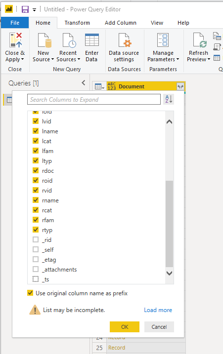

You will now see the columns you selected expanded in the Query Builder. The Query Builder is capable of very sophisticated subsequent manipulations of these columns however for the sake of this sample just hit the `Close & Apply` button in the top left-hand corner of the window to return to the Power BI desktop.

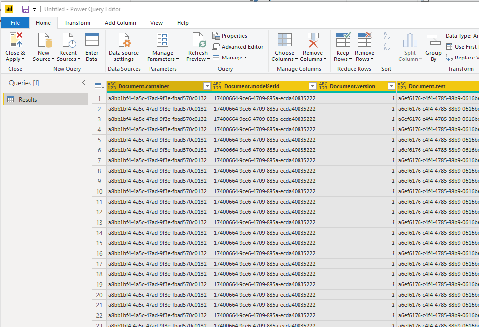

At this point you will be able to see the columns we selected in the fields panel on the right-hand side of the App. You can now start to build you report.

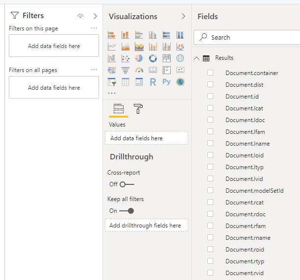

1. Add a `Treemap` Visualization from the Visualizations panel on the right-hand side of the App. 
2. Drag this Visualization until it fills approximately the left-hand side of the report design page. 
3. Drag `Document.lcat` (the Revit category of the left object in the clash pair) to the `Group` box. 
4. Drag `Document.ltyp` (the Revit type of the left object in the clash pair) to the `Details` box.
5. Drag `Document.id` (the clash ID) to the `Values` box and ensure that this is set to display the `Count of Document.Id`

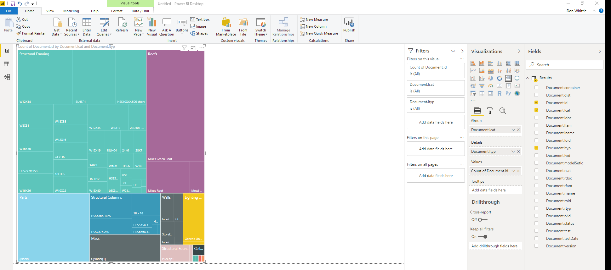

1. Add a `Treemap` Visualization from the Visualizations panel on the right-hand side of the App. 
2. Drag this Visualization until it fills approximately the right-hand side of the report design page. 
3. Drag `Document.rcat` (the Revit category of the right object in the clash pair) to the `Group` box. 
4. Drag `Document.rtyp` (the Revit type of the right object in the clash pair) to the `Details` box.
5. Drag `Document.id` (the clash ID) to the `Values` box and ensure that this is set to display the `Count of Document.Id`

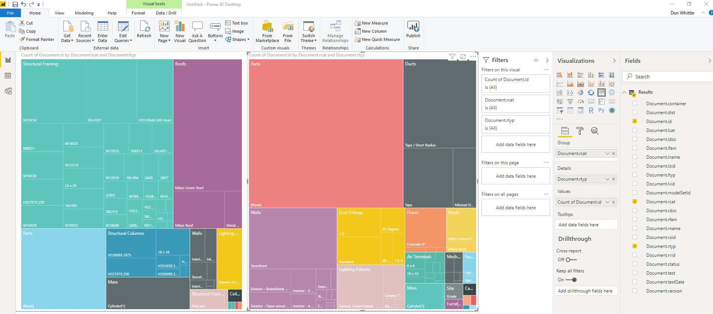

You can now interact with the report page, add more pages and visualizations. When you are ready publish your report to Power BI hit the `Publish` button and select a destination to publish to. If you have not saved your project at this point you will be prompted to save before the publishing operation completes.

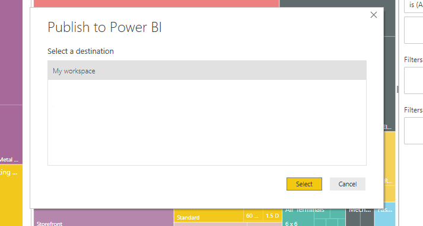

If successful you can expect to see something like this

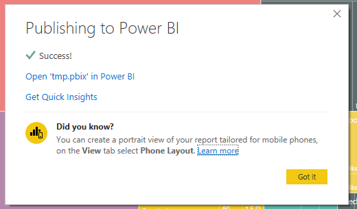

[Sign-in to the Power BI web portal](https://app.powerbi.com/?noSignUpCheck=1) and enjoy your report!

---
[home](../../../../README.md)