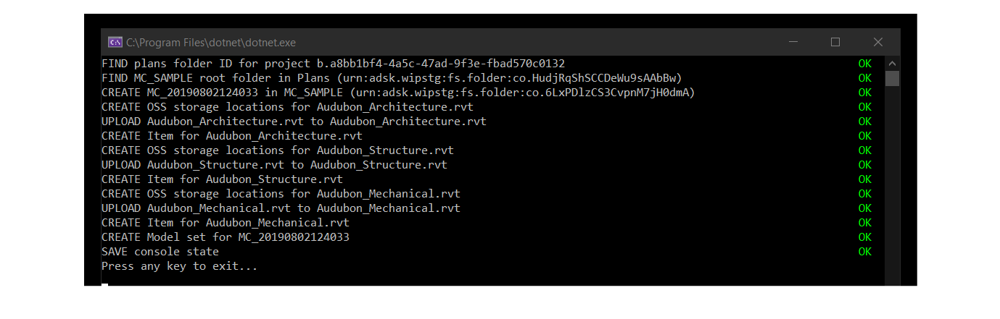
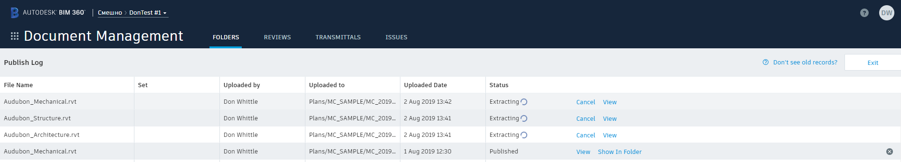
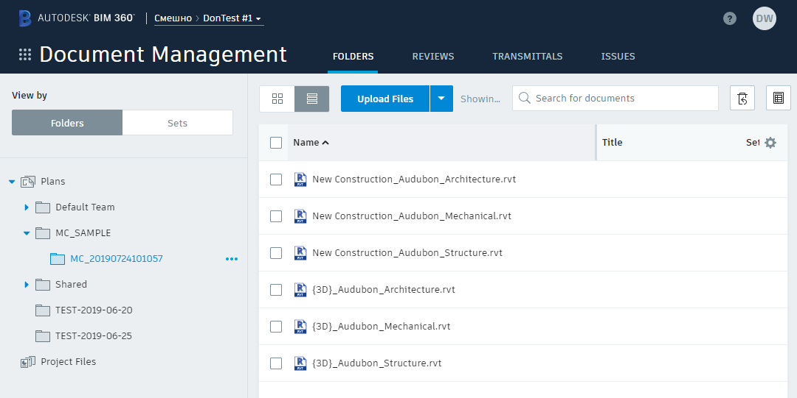
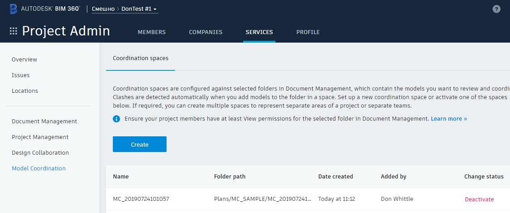
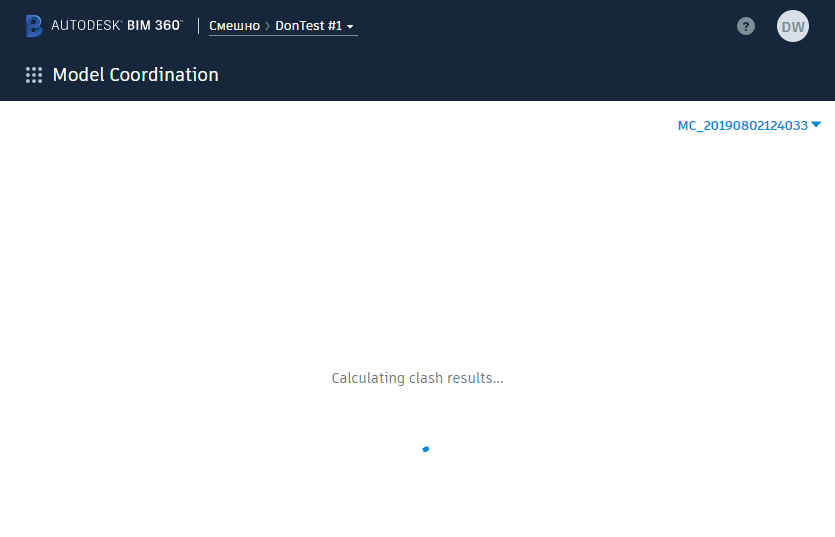
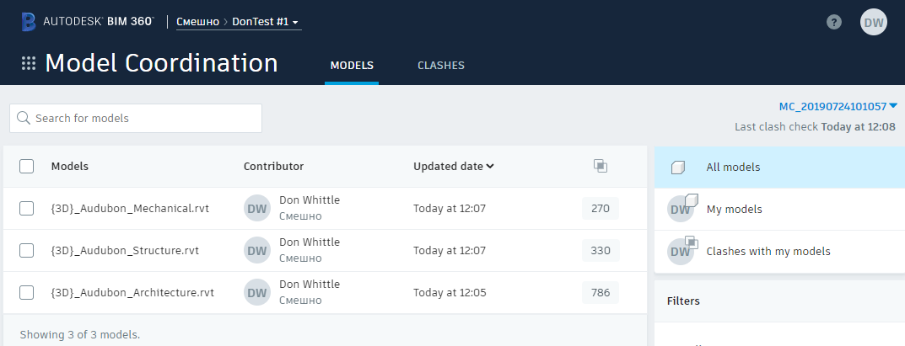

# Create a model set

### Demonstrates

This sample demonstrates the creation of a model set in an existing BIM 360 project from first principals. The app creates a test folder via Forge-DM, uploads three RVT files to this folder and then configures this folder as a BIM 360 Model Coordination model set. Access to Forge-DM is via the [`Autodesk.Forge`](https://www.nuget.org/packages/Autodesk.Forge/) nuget package.

### Environment Dependencies

- A cached OAuth user token has been set
- [TestEnvironmentSetup](../TestEnvironmentSetup/README.md) executed successfully

### Build and Run

```powershell
 PS > cd .\sample\dotnet\src\CreateModelSet
 PS > dotnet restore
 PS > dotnet build
 PS > dotnet run
```

### Code Walk-through

A [`IForgeDataClient`](../MCSample/Forge/ForgeDataClient.cs) client has been defined to encapsulate the functionality of [`Autodesk.Forge`](https://www.nuget.org/packages/Autodesk.Forge/) with the intent of making the work of the methods being called clearer.

```csharp
var forge = ctx.ExportService<IForgeDataClient>();
```

As the app executes it caches its progress in an instance of the `CreateModelSetState` type.

```csharp
var state = new CreateModelSetState();
```

This is saved to disk in a `state` folder under `.nucleus`

```powershell
PS > [System.IO.Path]::Combine([System.Environment]::GetFolderPath('UserProfile'), '.nucleus', 'state', 'CreateModelSetState')
```

Before files can be uploaded the app creates a `/Plans/MC_SAMPLE/{MC_{Year}{Month}{Day}{Hour}{Minute}{Second}}` folder, e.g. `Plans/MC_SAMPLE/MC_20190724101057`. This folder is used as the target for the model set.

```csharp
state.PlansFolder = await forge.FindTopFolderByName("Plans") ?? throw new InvalidOperationException("Could not find Plans folder!");

state.TestFolderRoot = await forge.FindFolderByName(state.PlansFolder.Id, SampleConstants.MC_SAMPLE_FOLDER_NAME);

if (state.TestFolderRoot == null)
{
    state.TestFolderRoot = await forge.CreateFolder(state.PlansFolder.Id, SampleConstants.MC_SAMPLE_FOLDER_NAME) ?? throw new InvalidOperationException($"Create {SampleConstants.MC_SAMPLE_FOLDER_NAME} failed!");
}

var testFolderName = $"MC_{DateTime.UtcNow.ToString("yyyyMMddHHmmss")}";

state.TestFolder = await forge.CreateFolder(state.TestFolderRoot.Id, testFolderName) ?? throw new InvalidOperationException($"Create {testFolderName} failed!");
```

Once the `state.TestFolder` has been created then the [sample files](../../../files/audubon-v1) can be uploaded. State caching aside the steps are as follows :-

```csharp
// Create an OSS storage URN, this is the bucket the bytes will be uploaded to
upload.Storage = await forge.CreateOssStorage(state.TestFolder.Id, upload.File.Name) ?? throw new InvalidOperationException($"Crete OSS storage object for {upload.File.Name} failed!");

// Physically transfer the bytes to OSS
upload.Result = await forge.Upload(upload.File, upload.Storage);

// Create an Item (and initial version of the item) via Forge-DM to make the system aware of the content
await forge.CreateItem(state.TestFolder.Id, upload.Storage.Id, upload.File.Name);
```

Now that the files have been uploaded and the extraction process has started the model set is created targeting the `state.TestFolder.Id` Forge-DM Folder URN.

```csharp
state.ModelSet = await modelSetClient.CreateModelSet(
    forge.Configuration.Project,
    state.TestFolder.Name,
    new ModelSetFolder[]
    {
        new ModelSetFolder
        {
            FolderUrn = state.TestFolder.Id
        }
    });
```

Finally the state collected by the execution of this app is saved to disk as described above. This state is used by the other sample apps in this collection.  [`SampleFileManager.cs`](../MCSample/SampleFileManager.cs) utility type is used to manage the `.nucleus\state` folder on disk.

```csharp
await SampleFileManager.SaveState(state);
```

If you were successful you will end up with a console which looks a bit like this.



At this point we have set a chain of events in motion which will take a short period of time to materialize fully in BIM 360. As we have uploaded our RVT files to a folder beneath the BIM 360 Project Plans folder the first step will be the extraction of 3D viewable content. If you switch quickly to Document Management and F5 you will see the folder we created however you will not necessarily see the files we have just uploaded. Clicking on the following button...


... in the top right-hand corner of the Docs UI will open the Publish Log. It is at this point you will get visibility of the files we have just uploaded. Depending on how quick you were switching to Docs you may see all three files with a status of Extracting.



So what's happening? The files we have uploaded, referred to as _seed files_ are being processed by the Forge Derivative Service which is (amongst other things) extracting the 3D views (including phase views in the case of Revit) and converting these to SVF Documents. When this extraction process has completed the views (Documents) will be visible in BIM 360 Docs and the SVF documents will be available via the Forge Model Derivative API. 



As alluded to above, this is just that start of the process. Switching quickly to Model Coordination in the BIM 360 Project Admin module you will be able to see the Model Set created by the console App



However, depending on how quickly you are at getting to the BIM 360 Model Coordination module you may be confronted by the following spinner...



So what's happening. Referring back to the [model set concept documentation](../../../../doc/model-sets.md) we are reminded that the Model Set Service samples the content uploaded to BIM 360 Docs to see if it can create new model set versions. Because we have programmatically just created a new model set the UI above indicates that the first model set version has been calculated and the first clash test is being performed against this version. As soon as the first model set version for the model set has been created you will be abel to view it in the BIM 360 Model Coordination application.



---
[home](../../../../README.md)