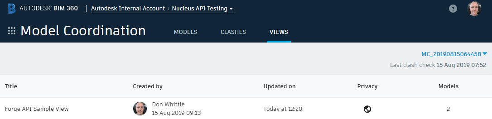

# Working With Model Set Views

### Demonstrates

Model set views are a mechanism for working with sub-sets of the model lineages in a BIM 360 model coordination model set. A model set view is defined as a specific sub-set of the model lineages contained within the folders which defined the model set content. A model set view has a name and description and can either be private or shared between users with access to the model set. In this App a sample view is created and then its private flag is toggled to public sharing it with other users on the project with access to the model set.

### Environment Dependencies

- A cached OAuth user token has been set
- [TestEnvironmentSetup](../TestEnvironmentSetup/README.md) executed successfully
- [CreateModelSet](../CreateModelSet/README.md) executed successfully
- [QueryModelSet](../QueryModelSet/README.md) executed successfully

### Build and Run

```powershell
 PS > cd .\sample\dotnet\src\ModelSetViews
 PS > dotnet restore
 PS > dotnet build
 PS > dotnet run
```

### Code Walk-through

First see if any views have been defined for the project by calling `GetModelSetViews` and looping through the results. We are looking for the named `SampleModelSetView.Name` view. If we do not find it `createSampleView` remains `true`.

```csharp
var views = await msClient.GetModelSetViews(modelSetState.ModelSet.ContainerId, modelSetState.ModelSet.ModelSetId);

Console.WriteLine();

if (views?.ModelSetViews.Count > 0)
{
    foreach (var view in views.ModelSetViews)
    {
        if (view.Name.Equals(SampleModelSetView.Name))
        {
            createSampleView = false;

            sampleView = view;
        }

        Console.WriteLine($"  - {view.Name}, is private: {view.IsPrivate}");
    }
}
else
{
    Console.WriteLine($"  No views found for model set {modelSetState.ModelSet.ModelSetId}, create sample...");
}
```

If `createSampleView == true` we will create the sample view only if the model set has a tip (latest) version and this model set version contains more that one document version. Note the sample view is created with `IsPrivate = true`. This means the view will only be in the _views_ list of the 3LO user creating the view. This sample view just picks the first two lineages in the current tip version of the sample model set as the value of `DocumentLineageUrns`on the `NewModelSetView` entity.

```csharp
var lineages = modelSetTipVersion.DocumentVersions.Take(2).Select(d => d.DocumentLineage.LineageUrn).ToList();

var modelSetView = new NewModelSetView
{
    Name = SampleModelSetView.Name,
    Description = SampleModelSetView.Description,
    IsPrivate = true,
    DocumentLineageUrns = lineages
};

sampleView = await msClient.CreateModelSetView(modelSetState.ModelSet.ContainerId, modelSetState.ModelSet.ModelSetId, modelSetView);
```

If successful you will ba able to see the default sample view in the BIM 360 model coordination UI...



Assuming that the default model views was just created the next step is to demonstrate how to toggle the public/private flag. This requires an update call where the current value is passed along with the new value for the property, in this case the `IsPrivate` flag.

```csharp
sampleView = await msClient.UpdateModelSetView(
    modelSetState.ModelSet.ContainerId,
    modelSetState.ModelSet.ModelSetId,
    sampleView.ViewId,
    new UpdateModelSetView
    {
        OldIsPrivate = true,
        NewIsPrivate = false
    });
```

Remember a model set view is a set of model _lineages_, to actually load the view into the LMV the the view needs to be dereferenced against a specific model set version into a set of model _versions_. That is the set of lineages is intersected with a model set version to yield a set of model versions. 

```csharp
var viewVersion = await msClient.GetModelSetViewVersion(
    modelSetState.ModelSet.ContainerId,
    modelSetTipVersion.ModelSetId,
    (uint)modelSetTipVersion.Version,
    sampleView.ViewId);

Console.WriteLine($"  - Resolve {sampleView.ViewId}, for model set version {modelSetTipVersion.Version}");

foreach (var doc in viewVersion.DocumentVersions)
{
    Console.WriteLine($"    - {doc.DisplayName} => {doc.VersionUrn}");
}
```

NB this process could be lossy. If a user defines a view with lineages A, B and C and model set version 1 contains A1, B1 and C2, dereferencing the view against model set version 1 yields A1, B1 and C1. Now let's suppose the user uploads new model versions of B and C and deletes A resulting in at _least_ one new model set version, 2 (model set version creation is non-deterministic so you could end up with a 3 versions at this point!). When the view is dereferenced against latest model set version, 2 for the sake of this discussion it will yield B2 and C2, the new model versions uploaded to the system when A was deleted in BIM 360 Docs.

---
[home](../../../../README.md)