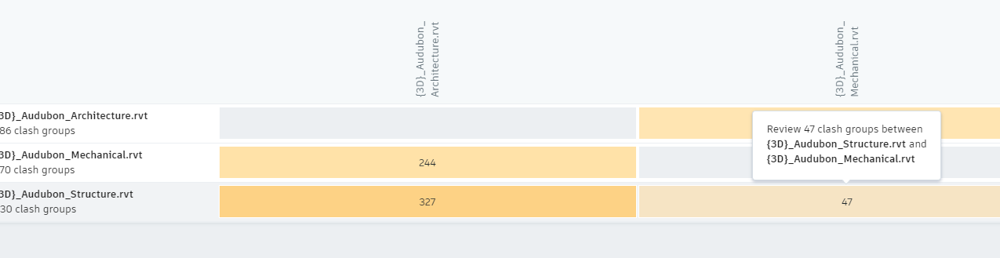
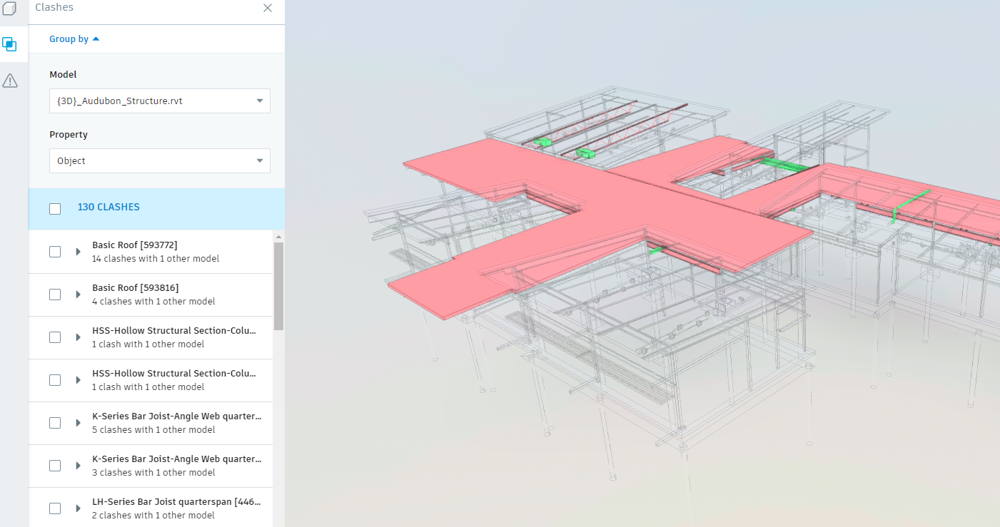
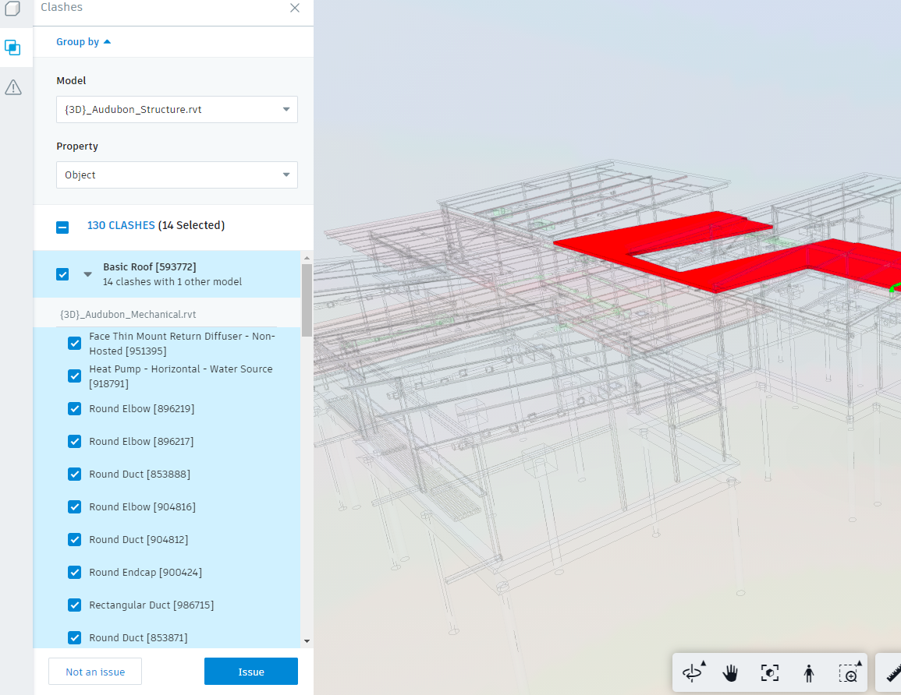
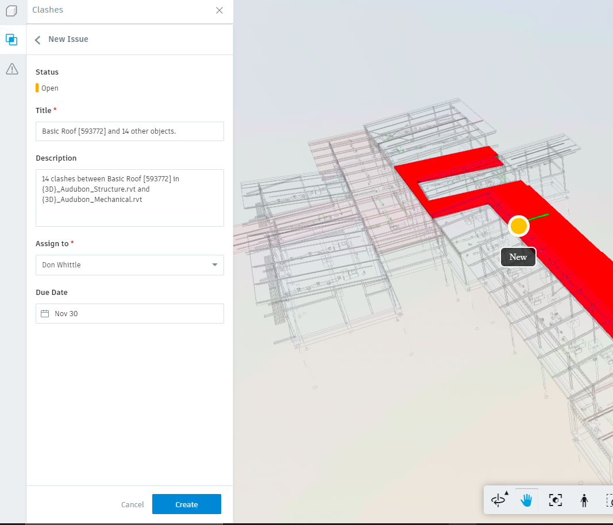
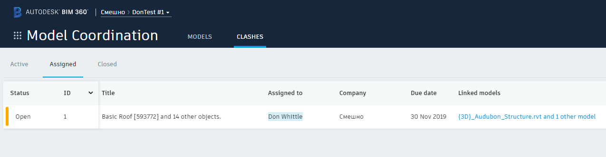
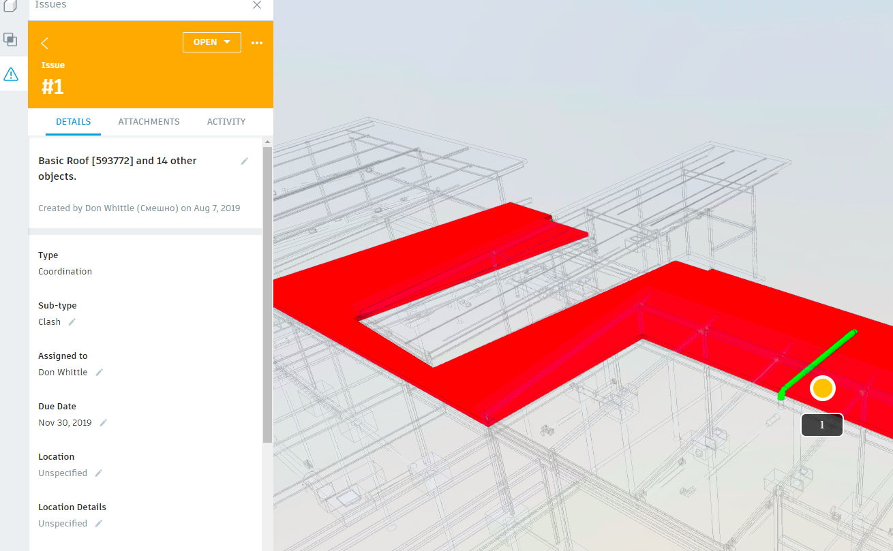
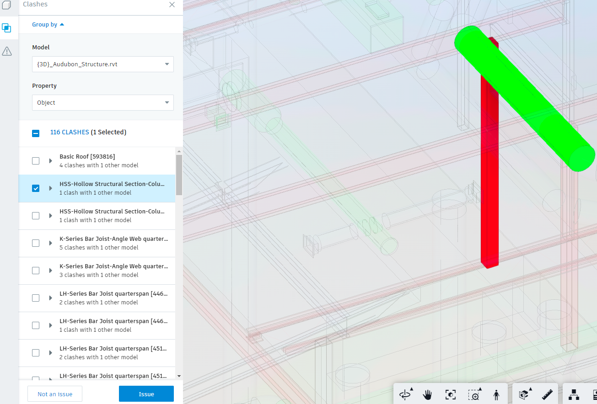
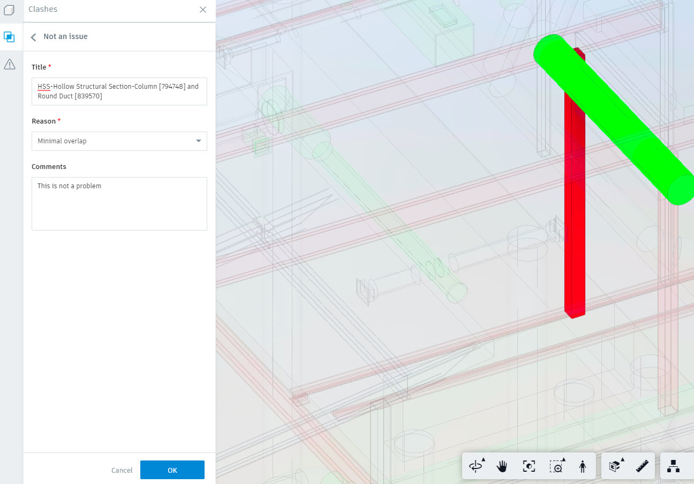
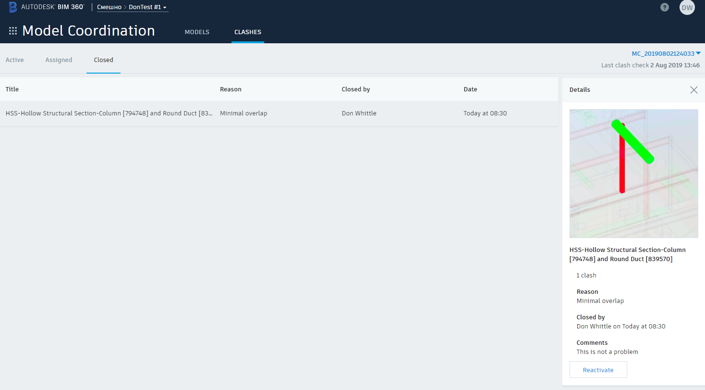

# Query Assigned and Closed Clash Groups

### Demonstrates

In this sample we query the results of user clash classification activity in the BIM 360 Model Coordination web application. The BIM 360 Model Coordination application provides users with the capability to group and classify clashes as either (1) problems which can be assigned to other users in the system as BIM 360 Issues or (2) clashes which do not represent a modelling problem and can be closed. Assigned clashes continue to appear in subsequent model set version clash test results until the user eradicates the clash, either by fixing the objects in the model or deleting objects or models. Closed clashes on the other hand are hidden from users in subsequent model set version clash tests, they are still there geometrically in the models however they are not presented to users.

### Environment Dependencies

- A cached OAuth user token has been set
- [TestEnvironmentSetup](../TestEnvironmentSetup/README.md) executed successfully
- [CreateModelSet](../CreateModelSet/README.md) executed successfully
- [QueryModelSet](../QueryModelSet/README.md) executed successfully
- [QueryClashTestResults](../QueryClashTestResults/README.md) executed successfully

This sample requires at least one assigned and one closed clash group. If you have not yet already created these assets via the BIM 360 Model Coordination application the next two sections briefly describe the workflow.

### Assigning a Group of Clashes

On the clashes tab in the BIM 360 Model Coordination application you are presented with the [clash matrix](../../../../doc/clash.md). Note that the numbers in the row/column intersection are not simple totals (see [clash matrix](../../../../doc/clash.md)). To open the viewer with the intersecting models containing clashes click the cell.



This will load the models into the viewer and open the clash inspection panel on the left-hand side of the window.



Select a set of clashes to assign to a BIM 360 Issue and click the `Issue` button.



This will open the issue create dialog pre-populated with a title and description. Add a push-pin and assign the issue to a user and click `Create`



If you close the viewer anc click on the `Assigned` sub-tab beneath the `Clashes` tab you should be able to see your newly created issue. 



If you click on the URL in the `Linked Models` column this will open the issue in view/edit mode in the viewer.



### Closing a Group of Clashes

The procedure for creating a closed clash group is similar, once a set of clashes has been selected to close hit the `Not and Issue` button.



Again you will be prompted for a title and a description. In addition you will also be asked to supply a `Reason` for wanting to ignore the selected clash results. Supply this information and hit `OK`. The application will automatically capture a screen shot of the viewers current content.



If successful you should be abel to see your closed clash group by clicking on the `Closed` child tab on the `Clashes` tab.



Now you have successfully classified clash results into assigned and closed clash groups you are ready to query these entities via the API.

### Build and Run

```powershell
 PS > cd .\sample\dotnet\src\CosmoDbUploader
 PS > dotnet restore
 PS > dotnet build
 PS > dotnet run
```

### Code Walk-through

First, load the `QueryClashTestResultsState` which holds the container, model set and version which we were previously working with.

```csharp
clashState = await SampleFileManager.LoadSavedState<QueryClashTestResultsState>();

Assert.NotNull(clashState);

Assert.True(clashState.HasLatest);
```

Before we can correlate the assigned clash groups stored by the BIM 360 model coordination clash service we need to determine the BIM 360 issues service which has been used to store the BIM 360 issue associated with the assigned clash group. This can be read from the Forge-DM /projects endpoint. The [ForgeDataClient.cs](../MCSample/Forge/ForgeDataClient.cs) helper client has a method which returns the Forge-DM Project JSON API as a dynamic c# object. The BIM 360 issues service container ID is determined by following the `data.relationships.issues.data.id` path on this object and casting the result to a GUID.

```csharp
Guid issueContainer = Guid.Empty;

var dataClient = ctx.ExportService<IForgeDataClient>();

dynamic obj = await dataClient.GetProjectAsJObject();

issueContainer = obj.data.relationships.issues.data.id;
```

Now we have the issue container we can query the assigned clash groups in as model set and link these to their associated BIM 360 issues. Grab the first page of assigned clash groups using the latest clash test ID (obtained from the cached state loaded previously) and then read their details using the batch endpoint provided.

```csharp
var assignedClashGroups = await clashClient.GetAssignedClashGroups(clashState.Container, clashState.Latest.Id);

var assignedClashGroupDetails = await clashClient.GetAssignedClashGroupDetailBatch(
    clashState.Container,
    clashState.Latest.Id,
    assignedClashGroups.Groups.Select(cg => cg.Id));
```

This code now iterates over the assigned clash groups in the `assignedClashGroups` collection, calling the BIM 360 issues service to get the details of the issue associated with each unique clash group and finally displaying a summary of the clash group. The call to the BIM 360 issue service is via a thin wrapper client, [ForgeIssueClient.cs](../MCSample/Forge/ForgeIssueClient.cs) which once again returns a dynamic objects representing the JSON API response from the BIM 360 issue service.

```csharp
foreach (var cg in assignedClashGroups.Groups)
{
    var detail = assignedClashGroupDetails.Single(i => i.Id == cg.Id);

    // https://forge.autodesk.com/en/docs/bim360/v1/reference/http/field-issues-:id-GET/
    dynamic issue = await issueClient.GetIssue(issueContainer, detail.IssueId);

    Console.WriteLine($"  Issue : {detail.IssueId}");
    Console.WriteLine($"  Title : {issue.data.attributes.title}");
    Console.WriteLine($"  Status : {issue.data.attributes.status}");
    Console.WriteLine($"  Created on : {issue.data.attributes.created_at}");
    Console.WriteLine($"  Clash count : {detail.ClashData.Clashes.Count}");
    Console.WriteLine($"  Clash document count : {detail.ClashData.Documents.Count}");
    Console.WriteLine($"  Clash instance count : {detail.ClashData.ClashInstances.Count}");
    Console.WriteLine($"  Existing clash count : {cg?.Existing.Count}");
    Console.WriteLine($"  Resolved clash count : {cg?.Resolved.Count}");
}
```

The procedure for querying closed clash groups follows the same pattern but is simplified by a not having to interact with the BIM 360 issues service. The code below includes the download of the automatic closed clash group screen shot taken by the BIM 360 model coordination application when the `Not an Issue` workflow was followed.

```csharp
var closedClashGroups = await clashClient.GetClosedClashGroups(clashState.Container, clashState.Latest.Id);

var closedClashGroupDetails = await clashClient.GetClosedClashGroupDetailBatch(
    clashState.Container,
    clashState.Latest.Id,
    closedClashGroups.Groups.Select(cg => cg.Id));

foreach (var cg in closedClashGroups.Groups)
{
    var detail = closedClashGroupDetails.Single(i => i.Id == cg.Id);

    Console.WriteLine($"  Title : {detail.Title}");
    Console.WriteLine($"  Reason : {detail.Reason}");
    Console.WriteLine($"  Created on : {detail.CreatedOn}");
    Console.WriteLine($"  Clash count : {detail.ClashData.Clashes.Count}");
    Console.WriteLine($"  Clash document count : {detail.ClashData.Documents.Count}");
    Console.WriteLine($"  Clash instance count : {detail.ClashData.ClashInstances.Count}");
    Console.WriteLine($"  Existing clash count : {cg?.Existing.Count}");
    Console.WriteLine($"  Resolved clash count : {cg?.Resolved.Count}");

    if (detail?.ScreenShots.Count > 0)
    {
        var screenShotId = detail.ScreenShots.First();

        var screenShot = SampleFileManager.NewStatePath($"{screenShotId}.png");

        using (var ss = await clashClient.GetScreenShotAsync(clashState.Container, clashState.Latest.ModelSetId, screenShotId))
        using (var fout = screenShot.Open(FileMode.Create))
        {
            await ss.Stream.CopyToAsync(fout);
        }

        Console.WriteLine($"  First screenshot : {screenShot.FullName}");
    }
}
```

---
[home](../../../../README.md)