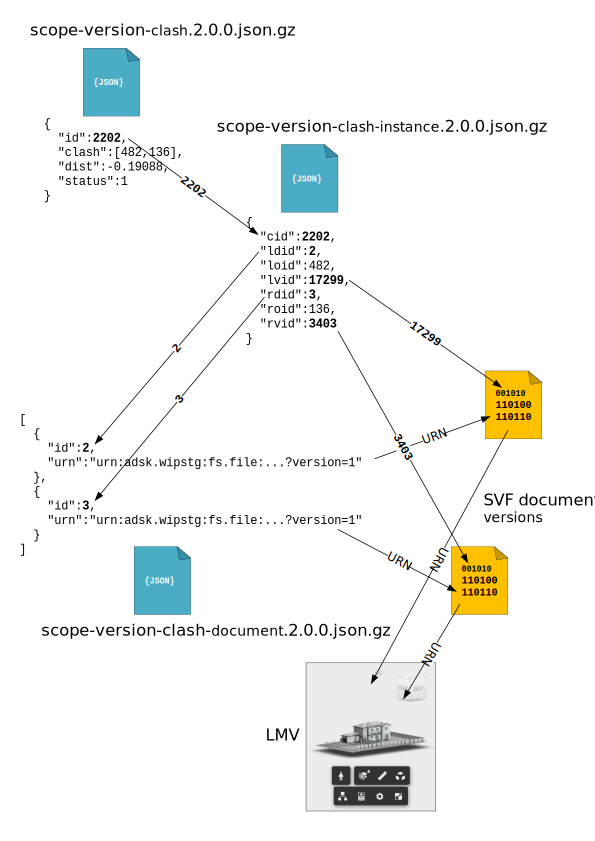

# Working with Model Set Clash Test Results

### Demonstrates

This .NET core console application demonstrates how to query model set clash results for clash tests performed against model set versions. It builds on the [CreateModelSet](../CreateModelSet/README.md) sample, which creates a test model set and uploads three sample files. In this sample app were are going to interrogate the model set clash tests which are run when model set versions are automatically created byt the system.

### Dependencies

- A cached OAuth user token has been set
- [TestEnvironmentSetup](../TestEnvironmentSetup/README.md) executed successfully
- [CreateModelSet](../CreateModelSet/README.md) executed successfully

### Build and Run

```powershell
 PS > cd .\sample\dotnet\src\QueryClashTestResults
 PS > dotnet restore
 PS > dotnet build
 PS > dotnet run
```

### Code Walk-through

To retrieve the model set created by the [CreateModelSet](../CreateModelSet/README.md) sample app we use the `IModelSetClient` which in turn wraps the `IScopesClientV3` from the [`Autodesk.Nucleus.Scopes.Client.V3`](https://www.nuget.org/packages/Autodesk.Nucleus.Scopes.Client.V3) nuget package. To retrieve clash results we require an additional client `IClashClient` which wraps the `IClashClientV3` from [`Autodesk.Nucleus.Clash.Client.V3`](https://www.nuget.org/packages/Autodesk.Nucleus.Clash.Client.V3) nuget package.

```csharp
var mcClient = ctx.ExportService<IModelSetClient>();
var clashClient = ctx.ExportService<IClashClient>();
```

As in the [QueryModelSet](../QueryModelSet/README.md) sample, we start by loading the cached state from a successful execution of the [CreateModelSet](../CreateModelSet/README.md) app. In this app we are also going to cache the `QueryClashTestResults` state.

```csharp
QueryCacheTestResultsState clashState = new QueryCacheTestResultsState();

modelSetState = await SampleFileManager.LoadSavedState<CreateModelSetState>();
```

The next step is to retrieve the clash tests which have been executed against the model set  which we are targeting.

```csharp
var tests = await clashClient.GetModelSetClashTests(modelSetState.ModelSet.ContainerId, modelSetState.ModelSet.ModelSetId);
```

We can display the summaries of the clash tests performed against the model set, specifically the model set versions the tests were performed against. In this app we pick the last clash test to dig into its details.

```csharp
if (tests.Tests.Count > 0)
{
    foreach (var test in tests.Tests.OrderBy(t => t.ModelSetVersion))
    {
        Console.WriteLine($"  {test.ModelSetId}:{test.ModelSetVersion:00}, {test.Status} : {test.CompletedOn?.ToString("u")} ");
    }

    clashState.Latest = tests.Tests.OrderBy(t => t.ModelSetVersion).Last();
}
```

When we have decided on a clash test we can pull its details.

```csharp
var clashTest = await clashClient.GetModelSetClashTest(modelSetState.ModelSet.ContainerId, clashState.Latest.Id);
```

Assuming we have a successful clash test for the model set version we can get the associated results (resources).

```csharp
clashState.ResourceCollection = await clashClient.GetModelSetClashTestResources(modelSetState.ModelSet.ContainerId, clashState.Latest.Id);

if (clashState.ResourceCollection?.Resources.Count > 0)
{
    Console.WriteLine();

    foreach (var res in clashState.ResourceCollection.Resources)
    {
        Console.WriteLine($"  {res.Url}");
    }
}
```

The results of clash testing are a set of GZIP compressed JSON files. In this case scopes are synonymous with model sets, i.e. the scope GUID is the model set GUID. 

| File | JSON Schema | Description |
| --- | --- | --- |
| scope-version-clash.2.0.0.json.gz | [scope-version-clash.2.0.0](../../../../schema/clash/v2/scope-version-clash.2.0.0.schema.json) | Pairwise, object-object Clash results |
| scope-version-clash-instance.2.0.0.json.gz | [scope-version-clash-instance.2.0.0](../../../../schema/clash/v2/scope-version-clash-instance.2.0.0.schema.json) | Viewable data for the objects in clashes listed in scope-version-clash.2.0.0.json.gz |
| scope-version-document.2.0.0.json.gz | [scope-version-document.2.0.0](../../../../schema/clash/v2/scope-version-document.2.0.0.schema.json) | Document URNs for the objects in clash instances listed in scope-version-document.2.0.0.json.gz |
| scope-version-object.2.0.0.json.gz | n/a | Reserved for future use |

This diagram summarises how these files relate to one another and viewable objects which can be displayed in the [Autodesk LMV viewer](http://lmv.ninja.autodesk.com/)



Every clash in the `scope-version-clash.2.0.0.json.gz` is given a _stable_ clash ID (`id`), 2202 in our example. The ID is referred to as _stable_ because it is invariant between clash tests performed on successive versions of the model set. For this to work the IDs of the objects which are clashed also needs to be stable. The `clash[]` array property on a clashes objects in the `scope-version-clash.2.0.0.json.gz` file contains the two stable object IDs participating in the clash pair, 482 and 136 in our example. Object stability in BIM 360 Model Coordination is maintained by the system. As part of the clash workflow the system maintains a set of stable object identities for individual objects on a seed file lineage. As users upload new versions of a seed file onto an existing seed file lineage the system uses the SIDs (Stable Object Identity) from the previous version of the seed file to determine if the new objects it is encountering are actually new to the lineage, or objects which were already on the lineage and may have stayed the same or changed only in terms of their graphical dimensions or the BIM data associated with them.

In order to view the clash results in the LMV it is necessary to process the `scope-version-clash-instance.2.0.0.json.gz` and `scope-version-document.2.0.0.json.gz` resources. The `scope-version-clash-instance.2.0.0.json.gz` resource contains the viewable object details of the clashes in the `scope-version-clash.2.0.0.json.gz` resource. The `cid` on the objects in the `scope-version-clash-instance.2.0.0.json.gz` is the `id` of the clash in the `scope-version-clash.2.0.0.json.gz` resource. `cid` is the foreign key between `scope-version-clash.2.0.0.json.gz` and `scope-version-clash-instance.2.0.0.json.gz`, likewise the `loid` and `roid`, left and right (stable) object ID, are the IDs of the stable objects reported in the `scope-version-clash.2.0.0.json.gz` `clash[]` array (482 and 136). 

To view these objects in the LMV it is necessary to ues another foreign key, `ldid` and `rdid`, left and right document ID, to ascertain the document version URNs which would need to be loaded into the LMV to view these clashes. `ldid` and `rdid` are indexes into the objects in `scope-version-document.2.0.0.json.gz`. These IDs can be used to look up the document URNs in the `scope-version-document.2.0.0.json.gz` resource (2 and 3 on our example). Once these documents have been loaded you can find the objects in the LMV using the `lvid` and `rvid`, left and right viewable IDs, which are the LMV object identities associated with these specific versions of the document (17299 and 3403). Note these viewable object IDs are NOT stable between successive seed file versions, i.e. the system makes no guarantee that stable object 482 will have an LMV viewable ID of 17299 in the next version of the document extracted by BIM 360 Docs following the upload of a new seed file version!

To work with these results download them locally.

```csharp
foreach (var resource in clashState.ResourceCollection.Resources)
{
    var name = new Uri(resource.Url).Segments.Last();

    var fout = SampleFileManager.NewStatePath(name);

    Console.WriteLine($"  Download {fout.Name}");

    await clashClient.DownloadClashTestResource(resource, fout);

    clashState.LocalResourcePaths[resource.Url] = fout;
}
```

The [`ClashResultFileReader<T>`](../MCSample/Model/ClashResultFileReader.cs) is a helper class which allows the results to be processed as a stream without the need to load the entire JSON document into memory. It uses [`Newtonsoft.Json`](https://www.nuget.org/packages/Newtonsoft.Json/) to find the first array in the file and then processes each element in the array as a `JObject`. This type is used to :-

Build an index of the Document URNs in the clash results...

```csharp
var documentIndexFile = clashState.LocalResourcePaths.Values.Single(f => f.Name.Equals("scope-version-document.2.0.0.json.gz", StringComparison.OrdinalIgnoreCase));

var documentIndexReader = new ClashResultFileReader<ClashDocument>(documentIndexFile, true);

var documentIndex = new Dictionary<int, string>();

await documentIndexReader.Read(doc =>
{
    documentIndex[doc.Index] = doc.Urn;

    return true;
});
```

Load the clash results and print counts to the console by clash status...

```csharp
var clashResultFile = clashState.LocalResourcePaths.Values.Single(f => f.Name.Equals("scope-version-clash.2.0.0.json.gz", StringComparison.OrdinalIgnoreCase));

var clashIndex = new Dictionary<int, Clash>();

var clashReader = new ClashResultFileReader<Clash>(clashResultFile, true);

await clashReader.Read(c =>
{
    clashIndex[c.Id] = c;

    return true;
});

// Show counts for the different clash statuses 
foreach (var group in clashIndex.Values.GroupBy(c => c.Status))
{
    Console.WriteLine($"  Clash count for status {group.Key}: {group.Count()}");
}
```

And pull the LMV viewable clash instance details for the clashing objects...

```csharp
var clashInstanceFile = clashState.LocalResourcePaths.Values.Single(f => f.Name.Equals("scope-version-clash-instance.2.0.0.json.gz", StringComparison.OrdinalIgnoreCase));

var clashInstanceReader = new ClashResultFileReader<ClashInstance>(clashInstanceFile, true);

var clashInstanceIndex = new Dictionary<int, ClashInstance>();

await clashInstanceReader.Read(ci =>
{
    clashInstanceIndex[ci.ClashId] = ci;

    return true;
});
```

Finally just to show how these three files relate to one another. Pick a random clash and display its viewable data.

```csharp
var rnd = new Random(Guid.NewGuid().GetHashCode());

var clash = clashIndex.Values.Skip(rnd.Next(0, clashIndex.Count - 1)).Take(1).Single();

Console.WriteLine($"  Clash : {clash.Id}");
Console.WriteLine($"  Left Document : {documentIndex[clashInstanceIndex[clash.Id].LeftDocumentIndex]}");
Console.WriteLine($"  Left Stable Object ID : {clashInstanceIndex[clash.Id].LeftStableObjectId}");
Console.WriteLine($"  Left LMV ID : {clashInstanceIndex[clash.Id].LeftLmvObjectId}");
Console.WriteLine($"  Right Document : {documentIndex[clashInstanceIndex[clash.Id].RightDocumentIndex]}");
Console.WriteLine($"  Right Stable Object ID : {clashInstanceIndex[clash.Id].RightStableObjectId}");
Console.WriteLine($"  Right LMV ID : {clashInstanceIndex[clash.Id].RightLmvObjectId}");
```

---
[home](../../../../README.md)