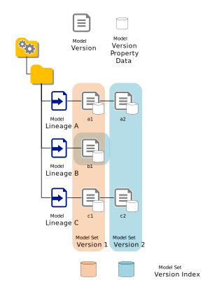

# Query Model Set Version Index

### Demonstrates

This sample demonstrates the indexing feature of the BIM 360 model coordination model set service. In the same manner that clash testing is performed for every new model set version created by the system (assuming the model set is enabled) an in dex of _ALL_ the data associated with the model versions is also constructed. This indexing workflow combines the individual BIM property databases extracted as part of the derivative service SVF conversion pipeline into a single database which supports SQL-like querying. Imagine a virtual table where every row is an object in the combined set of objects resulting from combining all of the seed files in the model set version where the columns of the table are the total set of unique property field types in the combined databases. This is in reality a highly sparse index given that any given object row only provides values for a small sub-set of the total set of possible fields in the unified data set.



### AWS S3 Select

The query language supported by the BIM 360 model coordination model set indexing API is Amazon's [S3 Select](https://docs.aws.amazon.com/AmazonS3/latest/dev/s3-glacier-select-sql-reference-select.html). Amazon's documentation also details the available [operators](https://docs.aws.amazon.com/AmazonS3/latest/dev/s3-glacier-select-sql-reference-operators.html) and [SQL functions](https://docs.aws.amazon.com/AmazonS3/latest/dev/s3-glacier-select-sql-reference-sql-functions.html) available to consumers of this API.

### Environment Dependencies

- A cached OAuth user token has been set
- [TestEnvironmentSetup](../TestEnvironmentSetup/README.md) executed successfully
- [CreateModelSet](../CreateModelSet/README.md) executed successfully
- [QueryModelSet](../QueryModelSet/README.md) executed successfully
- [QueryClashTestResults](../QueryClashTestResults/README.md) executed successfully

### Build and Run

```powershell
 PS > cd .\sample\dotnet\src\QueryModelSetVerisonIndex
 PS > dotnet restore
 PS > dotnet build
 PS > dotnet run
```

### Code Walk-through

Every model set version index has a manifest. This manifest details, amongst other things, the set of databases which were used to construct the index and crucially contains the mapping between the indexed data and the SVF geometry representing this data. 

```csharp
indexManifest = await msIndex.GetIndexManifest(state.Container, state.Latest.ModelSetId, (uint)state.Latest.ModelSetVersion);
```

If the index manifest exists then the index has been created successfully. The `IndexManifest.IndexManifestStatus` can be used to determine the status of the index. When the indexing workflow combines the property databases from the extracted SVF documents it builds a _fields_ resource. This resource is a system wide table of _ALL_ the unique fields in the combined index version. Each field has the following properties :-

| Property | Required | Description |
| -------- | -------- | ----------- |
| Key | `true` | Globally Unique key for the field (`p + CRC32`) |
| Type | `true` | The value type for the filed as defed by the `IndexFieldType` enum |
| Category | `false` | The category for field if supplied |
| Name | `true` | The name for the field |
| Uom | `false` | The unit of measure associated with the field value where applicable |

The following well-known, hard coded fields exist in every index and are injected by the workflow which builds the index version

| Key | Type | Category | Name | Description |
| --- | ---- | -------- | ---- |------------ |
| file | `IndexFieldType.Integer` | Nucleus | file | The index in the manifest for the seed file version the object data was extracted from |
| db | `IndexFieldType.Integer` | Nucleus | db | The index in the manifest for the the database version the object data was extracted from |
| docs | `IndexFieldType.Integer[]` | Nucleus | docs | The document indexes in the manifest which the object associated with the extracted data can be viewed in |
| id | `IndexFieldType.Integer` | Nucleus | db | The ID of the object |
| checksum | `IndexFieldType.Integer` | Nucleus | checksum | A checksum for the row in the index. This will be constant between model set index versions if the data associated with the object row does not change |

The following code downloads the fields resources and finds a field with the name `name` and category `__name__`.

```csharp
IndexField nameField = null;

fields = await msIndex.GetFields(state.Container, state.Latest.ModelSetId, (uint)state.Latest.ModelSetVersion);

Assert.NotNull(fields);

nameField = fields.Values.SingleOrDefault(f => f.Name.Equals("name", StringComparison.OrdinalIgnoreCase) &&
                                                                   f.Category.Equals("__name__", StringComparison.OrdinalIgnoreCase));
```

Once you have the field key it is possible to include it in an index query :-

```csharp
string query = $"select s.file, s.db, s.docs, s.id, s.{nameField.Key} from s3object s where s.{nameField.Key} is not missing";

queryResults = await msIndex.QueryIndex(state.Container, state.Latest.ModelSetId, (uint)state.Latest.ModelSetVersion, query);

queryResults.Refresh();

Assert.True(queryResults.Exists);
```

The `IndexResultReader.cs` helper class can read the results with or without field name substitution..

Without

```csharp

var reader = new IndexResultReader(queryResults, null);

int count = 0;

await reader.ReadToEndAsync(
    obj =>
    {
        count++;
        return Task.FromResult(true);
    }, false);

Console.WriteLine($"  processed {count.ToString("N0")} rows");
```

With

```csharp
var reader = new IndexResultReader(queryResults, fields);

int count = 0;

await reader.ReadToEndAsync(
    obj =>
    {
        count++;
        return Task.FromResult(true);
    }, true);

Console.WriteLine($"  processed {count.ToString("N0")} rows");
```

---
[home](../../../../README.md)