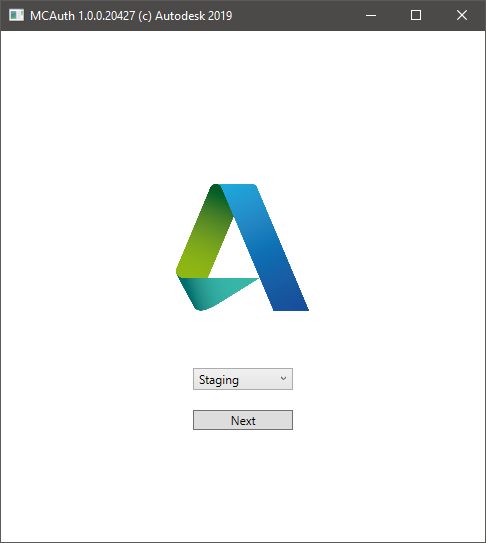
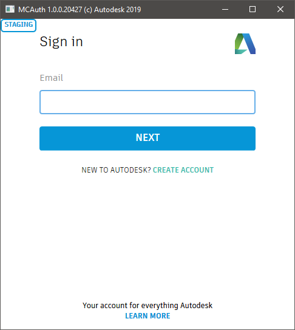
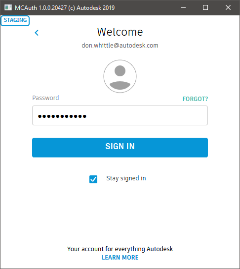
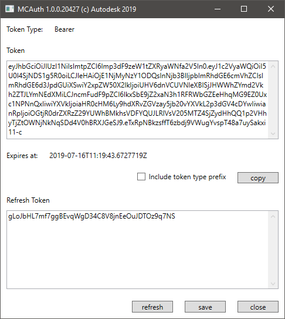
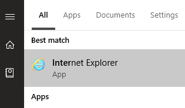
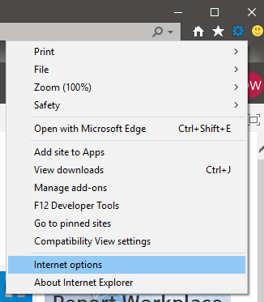
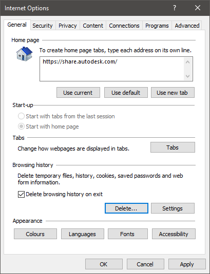
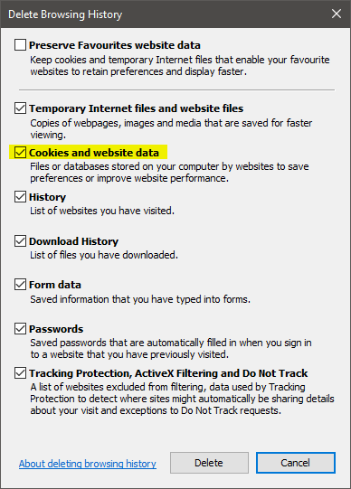

# MCAuth

MCAuth is a full-fat .NET 4.7.2 WPF desktop application which can be used to managed Forge OAuth tokens. This application can be used to obtain, refresh save and copy user tokens to the local developer environment. You can use MCConfig to set cached tokens however this application cannot be used to obtain a token as Forge OAuth 2.0 3LO authentication requires user interaction.

### Build and Run MCAuth

Assuming MSBuild tooling has been deployed with Visual Studio 2019 Professional. If you are using Enterprise or the Community edition you need to adjust the file path to MSBuild below.

```powershell
$ > cd .\tools\dotnet\src\MCAuth
$ > dotnet restore .\MCAuth.csproj
$ > & 'C:\Program Files (x86)\Microsoft Visual Studio\2019\Professional\MSBuild\Current\Bin\MSBuild.exe' .\MCAuth.csproj
$ > & .\bin\Debug\MCAuth.exe
```

### Sign In

Choose a configured environment from the settings defined using [MCConfig](dev-machine-setup.md).



Sign in with a Forge user ID.



Choose keep me signed in if you want to avoid signing in repeatedly as you explore the samples (recommended).



### Basic Usage



| Command | Description                                                                             |
| ------- | --------------------------------------------------------------------------------------- |
| Copy    | Copies the current token to the windows clipboard with an optional type (Bearer) prefix |
| Refresh | Use the refresh token to update the current user token                                  |
| Save    | Save the current token to the local developer environment (`.nucleus/token`)            |
| Close   | Close the application                                                                   |

## Trouble shooting 

### Removing IE 11 Forge Auth Cookies

MCAuth uses the out-of-the-box `<WebBrowser />` WPF browser control. This does not use the newer Windows Edge rendering engine, instead on Windows 10 machines this is a wrapper around Internet Explorer 11. If you are experiencing authentication issues with MCAuth you can try deleting any cached Forge auth tokens in the form on cookies held in the local user browser cache. To clear auth cookies on a Windows 10 machine:-

Run Internet Explorer 11



Use the menu in the top right-hand corner of the window to navigate to _Internet Options_



On the General tab click the _Delete..._ button under the _Browsing history_ heading.



Choose the content you wish to clear from the cache, crucially _Cookies and website data_



Depending on the size of the cache and whatever else IS is up to this could take a moment or two, a toast appears at the bottom of the Explorer window once the cache has been successfully cleared.


---
[back](../../../../README.md)